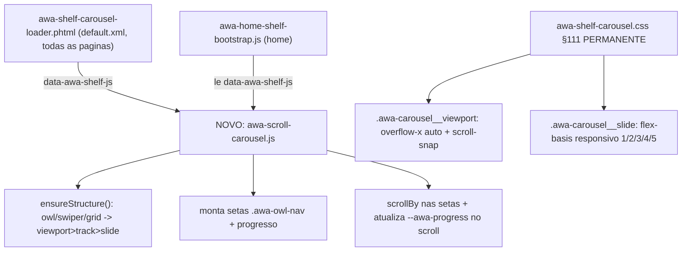

# Carrossel CSS Scroll-Snap Nativo (zero dependências)

## Por que esta abordagem

O carrossel mais moderno e limpo hoje é o **scroll-snap nativo do browser**: sem biblioteca, sem init JS de layout, sem FOUC/CLS. Isso responde ao pedido ("instalar o mais moderno e clean") eliminando a raiz dos bugs recorrentes: a integração Swiper convertia markup `owl` em runtime, sem o CSS oficial da lib, com lazy-init que espremia os cards. Não há repositório a instalar; a plataforma (CSS Scroll Snap) já é suportada por todos os browsers.

A CSS de scroll-snap **já existe** em [awa-shelf-carousel.css](app/design/frontend/AWA_Custom/ayo_home5_child/web/css/awa-shelf-carousel.css) (§111, linhas 215-260), hoje escopada a `:not(.swiper-initialized)` como fallback. O trabalho central é promovê-la a padrão e trocar o motor JS.

## Arquitetura



DOM unificado alvo (produzido por `ensureStructure`, reaproveitando a lógica atual sem Swiper):

```
.awa-carousel
  .awa-carousel__viewport   (scroll container: overflow-x:auto + scroll-snap-type)
    .awa-carousel__track    (flex nowrap, align-items:stretch -> alturas iguais por CSS)
      .awa-carousel__slide  (flex 0 0 responsivo, scroll-snap-align:start)
  .awa-owl-nav (setas, ja estilizadas)
  .awa-owl-progress (barra, ja estilizada)
```

## Escopo (confirmado: todos os carrosséis)

- Grupo A (ja unificado): bestseller, newproduct, superdeals, awa-pdp-related
- Grupo B (owl legado `.row>ul.owl`): featured, mostviewed, toprate, onsale
- Magento nativo: related (`#relate_product_slider`), upsell (`#upsell_product_slider`)
- Grupo C (Swiper nativo PDP): `awa-pdp-mostviewed.phtml` (mantem as abas de marca, normaliza so o carrossel)
- Grupo D (abas de categoria, owl externo): `categorytab` / `producttab` — passo separado, maior risco

## Passos

### 1. Novo motor `awa-scroll-carousel.js`
Criar `web/js/awa-scroll-carousel.js` (+ `.min.js`) baseado no `awa-shelf-swiper.js` atual, reaproveitando `ensureShelfStructure`, `prepareChrome` (setas/progresso), `scanShelf` e `whenVisible`, mas:
- Remover `loadSwiper`/`new Swiper`. No lugar, marcar o viewport como scroll container e ligar a navegação:

```js
function wireScroll(vp, prev, next, progress){
  var ease = reducedMotion() ? 'auto' : 'smooth';
  function step(d){ vp.scrollBy({ left: d * Math.max(240, Math.round(vp.clientWidth*0.9)), behavior: ease }); }
  prev.addEventListener('click', function(){ step(-1); });
  next.addEventListener('click', function(){ step(1); });
  function update(){
    var max = vp.scrollWidth - vp.clientWidth, x = vp.scrollLeft;
    prev.classList.toggle('is-disabled', x <= 2);
    next.classList.toggle('is-disabled', x >= max - 2);
    if (progress){ var bar = progress.querySelector('.awa-owl-progress__bar');
      if (bar) bar.style.setProperty('--awa-progress', String(max<=0?1:Math.min(1,Math.max(.08,x/max)))); }
  }
  vp.addEventListener('scroll', function(){ requestAnimationFrame(update); }, { passive:true });
  window.addEventListener('resize', function(){ requestAnimationFrame(update); }, { passive:true });
  update();
}
```

- Expor `window.AWA_SHELF_CAROUSEL = { engine:'css-scroll-snap', scan, ... }` (compatibilidade com `owl-carousel-init.js`/`awa-carousel-nav.js`).
- Estender a deteccao de track em `ensureShelfStructure` para incluir `.swiper-wrapper` (Grupo C), normalizando `.swiper-slide` como `.awa-carousel__slide` sem inicializar Swiper.

### 2. CSS: promover §111 a permanente
Em [awa-shelf-carousel.css](app/design/frontend/AWA_Custom/ayo_home5_child/web/css/awa-shelf-carousel.css):
- Remover o guard `:not(.swiper-initialized)` de §111 (linhas 215-260): `.awa-carousel__viewport` passa a ser sempre o scroll container (overflow-x:auto, scroll-snap-type:x proximity, scroll-behavior:smooth, scrollbar oculta, scroll-padding-inline:8px).
- Aplicar `flex: 0 0 <base>%` + `scroll-snap-align:start` aos slides em todas as formas (`.awa-carousel__slide`, `.swiper-slide`, `li.item`), com breakpoints: mobile 1.15 (peek, melhor affordance), ≥480 2, ≥768 3, ≥1024 4, ≥1366 5.
- `align-items:stretch` no track ja garante alturas iguais por CSS, removendo a necessidade do `equalizeCardsFallback` JS.
- Remover regras de runtime do Swiper (`.awa-shelf-swiper.*`, `.swiper-button-lock`, `.swiper-notification`, §111b `flex-shrink:0`) que ficam obsoletas.
- `@media (prefers-reduced-motion:reduce)`: `scroll-behavior:auto`.

### 3. Eager critical (sem flash na home above-fold)
Em [awa-head-preload-critical-home.css](app/design/frontend/AWA_Custom/ayo_home5_child/web/css/awa-head-preload-critical-home.css): adicionar as mesmas regras permanentes de `.awa-carousel__viewport` + sizing de slide para os shelves above-fold (Mais Vendidos), garantindo o layout correto no 1o paint independentemente do CSS async. Manter as regras `ul.owl:not(.owl-loaded)` para o instante antes do JS normalizar.

### 4. Trocar o motor no loader
Em [awa-shelf-carousel-loader.phtml](app/design/frontend/AWA_Custom/ayo_home5_child/Magento_Theme/templates/html/awa-shelf-carousel-loader.phtml): apontar `$jsUrl` para `js/awa-scroll-carousel.js`, bump `$shelfAssetV` (ex.: `20260603-scroll113`). Isso cobre todas as paginas (e a home via `awa-home-shelf-bootstrap.js`, que le o mesmo atributo).

### 5. Grupo C (PDP mostviewed) e Grupo D (abas de categoria)
- Grupo C: o motor normaliza `.swiper-wrapper`/`.swiper-slide`; abas de marca (JS separado) permanecem.
- Grupo D (`categorytab`/`producttab`): hoje usam `owl-carousel` real via `tab-carousel-init.js`. Ajustar para nao inicializar Owl e delegar ao novo motor (achatar `.product_row`). Passo isolado, com validacao propria (sao widgets, possivelmente nao ativos na home atual).

### 6. Limpeza de dependencias (opcional, baixo risco)
- Parar de carregar `awa-shelf-swiper.js`; remover `swiper` do `requirejs-config.js` (map/paths/shim) se nenhum outro consumidor restar.
- Revisar `owl-carousel-init.js`, `awa-legacy-swiper-init.js`, `awa-carousel-nav.js`: manter so o que delega ao novo motor; remover init Owl/Swiper redundante.
- NAO mexer em `awa-home-category-carousel.js` (carrossel de categorias do topo, ja e scroll-snap proprio e funciona).

### 7. Build, deploy e validacao
- Minificar (`clean-css-cli -O2`) + Brotli `-q 11` (validar `orig==br_dec`) de `awa-shelf-carousel.min.css` e `awa-head-preload-critical-home.min.css`; minificar `awa-scroll-carousel.min.js`.
- Publicar em `pub/static/.../pt_BR/css|js` (e `en_US` se existir).
- `cache:flush block_html full_page`, `redis -n 2 FLUSHDB` (FPC), `systemctl restart php8.4-fpm`.
- Validar via Playwright em 1366 / 1024 / 768 / 390: `slideW` correto (5/4/3/~1.15 por vista), scroll horizontal funcional, setas habilitam/desabilitam nas pontas, barra de progresso, sem `swiper-initialized`, sem overflow horizontal da pagina, sem erros de console, `exception.log` limpo. Conferir Home, PDP (related/upsell/mostviewed) e categoria.

## Resultado esperado
- Carrossel nativo, instantaneo no 1o paint (sem flash), sem dependencia de Swiper/owl.
- Mesma identidade visual (setas, barra, cards) reaproveitando o CSS atual.
- Codigo drasticamente mais simples e manutenivel: 1 motor JS pequeno + CSS declarativo, em vez de Swiper + conversao owl + multiplas camadas de fallback.
