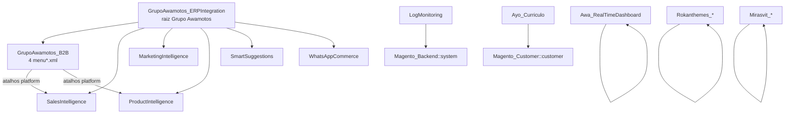
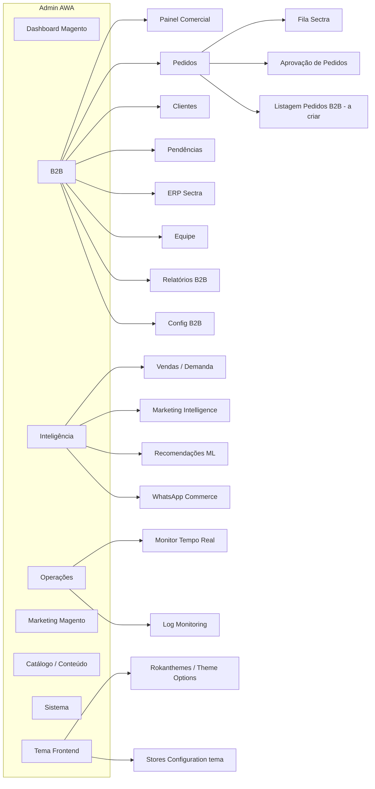

# Auditoria UX — Magento Admin Menu (AWA Motos)

**Data:** 2026-07-22
**Escopo:** inventário de todos os `etc/adminhtml/menu*.xml` em `app/code` + core Magento (`vendor/magento`)
**Método:** parse estático dos XMLs + leitura de plugins de visibilidade + `config:show` em runtime
**Restrição:** **nenhuma alteração de código** — documento somente

---

## 0. Veredito executivo

O Admin está com **três árvores B2B/comerciais ativas ao mesmo tempo**:

| Flag runtime | Valor |
|---|---|
| `grupoawamotos_b2b/platform/unified_menu_enabled` | **1** (ligado) |
| `grupoawamotos_b2b/platform/legacy_menu_visible` | **1** (ligado) |

Com isso, o usuário vê simultaneamente:

1. **B2B** (menu unificado / `menu_platform.xml`)
2. **AWA Comercial** (`menu_commercial*.xml`)
3. **Grupo Awamotos → B2B** (`menu.xml` clássico)

Resultado: **24 actions duplicadas** (26 entradas extras só por espelhamento), **5 “Dashboard”** com nomes genéricos, pasta **Pedidos B2B** sem tela filha de listagem (só “Aprovação”), e **~25 atalhos Rokanthemes** que só abrem `Stores → Configuration`.

---

## 1. Inventário quantitativo

| Origem | Arquivos menu | Itens `<add>` | Folhas (com `action`) | Pastas |
|---|---:|---:|---:|---:|
| Custom (`app/code`) | 43 | **150** | 117 | 33 |
| Core Magento (`vendor/magento`) | 39 | **125** | — | — |
| **Total parseado** | **82** | **275** | — | — |

### Custom por namespace

| Namespace | Itens |
|---|---:|
| GrupoAwamotos | 87 |
| Rokanthemes | 47 |
| Mirasvit | 12 |
| Awa | 2 |
| Ayo | 2 |

### Top-level custom (raiz do Admin)

| sortOrder | Título | ID | Arquivo |
|---:|---|---|---|
| 5 | Monitor Tempo Real | `Awa_RealTimeDashboard::main` | `Awa/RealTimeDashboard/.../menu.xml` |
| 14 | B2B | `GrupoAwamotos_B2B::platform` | `B2B/.../menu_platform.xml` |
| 15 | AWA Comercial | `GrupoAwamotos_B2B::commercial` | `B2B/.../menu_commercial.xml` |
| 50 | Rokanthemes | `Rokanthemes_RokanBase::rokanbase` | `Rokanthemes/RokanBase/.../menu.xml` |
| 55 | Grupo Awamotos | `GrupoAwamotos_ERPIntegration::grupo_awamotos` | `ERPIntegration/.../menu.xml` |
| 56 | Instagram | `Rokanthemes_Instagram::instagram` | `Rokanthemes/Instagram/.../menu.xml` |
| 70 | Mirasvit | `Mirasvit_Core::menu` | `Mirasvit/Core/.../menu.xml` |

*(Core Magento adiciona Dashboard, Sales, Catalog, Customers, Marketing, Content, Reports, Stores, System — omitidos aqui por serem padrão CE.)*

---

## 2. Arquivos `menu.xml` responsáveis (custom)

| Módulo | Arquivo(s) | Papel |
|---|---|---|
| **GrupoAwamotos_B2B** | `menu.xml` | Árvore clássica sob Grupo Awamotos → B2B |
| **GrupoAwamotos_B2B** | `menu_commercial.xml` | Raiz **AWA Comercial** |
| **GrupoAwamotos_B2B** | `menu_commercial_intelligence.xml` | Extensões de AWA Comercial (recompra, metas…) |
| **GrupoAwamotos_B2B** | `menu_platform.xml` | Raiz **B2B** unificada + “Modo Clássico” |
| GrupoAwamotos_ERPIntegration | `menu.xml` | Raiz **Grupo Awamotos** + pasta ERP |
| GrupoAwamotos_SalesIntelligence | `menu.xml` | Inteligência de Vendas sob ERP |
| GrupoAwamotos_MarketingIntelligence | `menu.xml` | Marketing Intelligence (4 níveis) |
| GrupoAwamotos_ProductIntelligence | `menu.xml` | Product Intelligence / REXIS ML |
| GrupoAwamotos_SmartSuggestions | `menu.xml` | Sugestões Inteligentes *(marcado “to be deprecated” no XML)* |
| GrupoAwamotos_WhatsAppCommerce | `menu.xml` | WhatsApp Commerce |
| GrupoAwamotos_LogMonitoring | `menu.xml` | Sob System |
| Awa_RealTimeDashboard | `menu.xml` | Monitor Tempo Real (raiz) |
| Ayo_Curriculo | `menu.xml` | Sob Customers |
| Rokanthemes_* (27) | `menu.xml` cada | Tema + widgets + config shortcuts |
| Mirasvit_* | `menu.xml` | Search Management |

**Mecanismo extra:** `ExtendedMenuConfigReaderPlugin` mescla `menu_commercial*.xml` + `menu_platform.xml` porque o core só lê `menu.xml` por módulo.
**Visibilidade:** `PlatformMenuVisibilityPlugin` — com `unified=1` e `legacy_visible=1`, **não remove** as árvores legadas.

---

## 3. Mapa completo — Grupo Awamotos / AWA / Ayo

Legenda de cliques: profundidade do item a partir da raiz do Admin (1 = top-level).

### 3.1 Árvore A — B2B unificado (`menu_platform.xml`)

| Breadcrumb | ID | Action (frontName/…) | ACL | Cliques | Classificação |
|---|---|---|---|---:|---|
| B2B | `::platform` | — | `::commercial` | 1 | **MANTER** (raiz canônica) |
| B2B › Dashboard | `::platform_dashboard` | `awa_commercial/commercialdashboard/index` | `::commercial_dashboard` | 2 | **MANTER** |
| B2B › Pedidos B2B | `::platform_orders` | — | `::platform_orders` | 2 | **MANTER** pasta; falta leaf de listagem |
| B2B › Pedidos B2B › Aprovação de Pedidos | `::platform_orders_approval` | `grupoawamotos_b2b/approval/index` → `Adminhtml\Approval\Index` | `::order_approval` | 3 | **MANTER** |
| B2B › Clientes B2B › Todos os Clientes | `::platform_customers_all` | `grupoawamotos_b2b/customer/index` | `::customer_approval` | 3 | **MANTER** |
| B2B › Clientes B2B › Minha Carteira | `::platform_customers_portfolio` | `awa_commercial/commercialportfolio/index` | `::commercial_portfolio` | 3 | **MANTER** |
| B2B › Pendências… › Pendências da Carteira | `::platform_pending_portfolio` | `awa_commercial/commercialpending/index` | `::commercial_pending` | 3 | **MANTER** |
| B2B › Pendências… › Aprovação de Cadastro | `::platform_pending_approval` | `grupoawamotos_b2b/customer/pending` | `::customer_approval` | 3 | **MANTER** |
| B2B › Pendências… › Tarefas / Carrinhos / Parados / Recompra | vários | `awa_commercial/commercial*` | ACL commercial_* | 3 | **MANTER** |
| B2B › Validação ERP/Sectra › Clientes Aguardando ERP | `::platform_sectra_erp_pending` | `grupoawamotos_b2b/customer/erpPending` → `Adminhtml\Customer\ErpPending` | `::customer_approval` | 3 | **MANTER** |
| B2B › Validação ERP/Sectra › Fila Sectra — Pedidos ERP | `::platform_sectra_queue` | `grupoawamotos_b2b/sectraQueue/index` | `::sectra_queue` | 3 | **MANTER** |
| B2B › Atendentes › Gestão / Metas / Ranking | vários | attendant / commercialgoal / ranking | ACL respectivas | 3 | **MANTER** |
| B2B › Relatórios › Relatórios Comerciais | `::platform_reports_commercial` | `awa_commercial/commercialreport/index` | `::commercial_reports` | 3 | **MANTER** |
| B2B › Relatórios › Inteligência de Vendas | `::platform_reports_si` | `salesintelligence/dashboard/index` | `SalesIntelligence::dashboard` | 3 | **UNIFICAR** (com item sob Grupo Awamotos) |
| B2B › Auditoria | `::platform_audit` | `grupoawamotos_b2b/notification/index` | `::notifications` | 2 | **MANTER** (renomear p/ “Log de Notificações”) |
| B2B › Configurações | `::platform_config` | `admin/system_config/.../grupoawamotos_b2b` | `::config` | 2 | **MANTER** |
| B2B › Modo Clássico › * (8 atalhos) | `::platform_legacy_*` | espelhos de actions já existentes | várias | 3 | **OCULTAR** → depois **REMOVER** |

### 3.2 Árvore B — AWA Comercial (`menu_commercial*.xml`)

| Item | Action | Cliques | Classificação |
|---|---|---:|---|
| Meu Painel | `awa_commercial/commercialdashboard/index` | 2 | **OCULTAR** (duplica B2B › Dashboard) |
| Minha Carteira | `.../commercialportfolio/index` | 2 | **OCULTAR** |
| Tarefas / Carrinhos / Pendentes / Recompra / Parados / Metas / Ranking / Relatórios | `awa_commercial/*` | 2 | **OCULTAR** (já no unificado) |
| Raiz AWA Comercial | — | 1 | **OCULTAR** quando unified=1 |

### 3.3 Árvore C — Grupo Awamotos → B2B (`menu.xml`)

| Item | Action | Cliques | Classificação |
|---|---|---:|---|
| Meu Painel | `grupoawamotos_b2b/attendant/dashboard` | 3 | **MOVER** p/ B2B unificado (é painel distinto do commercial) |
| Meta B2B Dashboard | `grupoawamotos_b2b/dashboard/index` | 3 | **UNIFICAR** com Dashboard ou **OCULTAR** se obsoleto |
| Clientes Pendentes / Todos / Cotações / Fila Sectra / Empresas / Crédito / Aprovação / Transportadoras / Atendentes / Notificações / Ajuda / Config | várias | 3 | **OCULTAR** (duplicam platform) — expor só via unificado ou Modo Clássico controlado |
| Raiz Grupo Awamotos › B2B | — | 2 | **OCULTAR** se `legacy_menu_visible=0` |

### 3.4 Inteligência / ERP / WhatsApp / Logs / Outros

| Breadcrumb | Módulo | Action | Cliques | Classificação |
|---|---|---|---:|---|
| Grupo Awamotos › ERP Integration › Inteligencia de Vendas | SalesIntelligence | `salesintelligence/dashboard/index` | 3 | **MOVER** p/ B2B › Relatórios (ou Inteligência) e **OCULTAR** cópia |
| … › Marketing Intelligence › * (4 telas) | MarketingIntelligence | `marketingintelligence/*` | **4** | **MOVER** p/ raiz “Inteligência” (reduzir 1 nível) |
| … › Product Intelligence › Dashboard ML / Recomendações | ProductIntelligence | `rexisml/*` | 3 | **MANTER**; **UNIFICAR** nomenclatura REXIS |
| … › Sugestoes Inteligentes › * (5 telas) | SmartSuggestions | `smartsuggestions/*` | 3 | **UNIFICAR** com Product Intelligence / comercial recompra; XML já diz *deprecated* |
| … › WhatsApp Commerce › Dashboard / Consent | WhatsAppCommerce | `whatsappcommerce/*` | 3 | **MANTER** (ou MOVER p/ Marketing) |
| Monitor Tempo Real › Dashboard ao Vivo | Awa_RealTimeDashboard | `awa_dashboard/dashboard/index` | 2 | **MANTER** (ops); avaliar UNIFICAR com Log Monitoring |
| System › AWA Log Monitoring › * | LogMonitoring | `awalogmonitoring/*` | 3 | **MANTER**; traduzir labels EN→PT |
| Customers › Currículos › Ver Candidaturas | Ayo_Curriculo | `curriculo/submission/index` | 3 | **MANTER** ou **OCULTAR** se RH não usa |

### Controllers (padrão Magento)

Action `frontName/controller/action` resolve para:

`Vendor\Module\Controller\Adminhtml\{Controller}\{Action}`

Exemplos:

| Action | Controller |
|---|---|
| `grupoawamotos_b2b/sectraQueue/index` | `GrupoAwamotos\B2B\Controller\Adminhtml\SectraQueue\Index` |
| `grupoawamotos_b2b/customer/erpPending` | `...\Customer\ErpPending` |
| `awa_commercial/commercialdashboard/index` | `...\CommercialDashboard\Index` (rota `awa_commercial`) |
| `salesintelligence/dashboard/index` | `GrupoAwamotos\SalesIntelligence\Controller\Adminhtml\Dashboard\Index` |

FrontNames relevantes (`routes.xml`): `grupoawamotos_b2b`, `awa_commercial`, `awa_b2b`, `b2b`, `erpintegration`, `salesintelligence`, `marketingintelligence`, `rexisml`, `smartsuggestions`, `whatsappcommerce`, `awalogmonitoring`, `awa_dashboard`, `curriculo`.

---

## 4. Dependências entre módulos (menu)



Plugins B2B que alteram a árvore efetiva:

- `ExtendedMenuConfigReaderPlugin` — injeta 3 XMLs extras
- `PlatformMenuVisibilityPlugin` — liga/desliga platform vs legacy

---

## 5. Problemas de UX identificados

### 5.1 Menus / actions duplicados (P0)

Com **unified=1 e legacy=1**, as mesmas telas aparecem em até **3 lugares**. Exemplos:

| Action | Aparece em |
|---|---|
| `awa_commercial/commercialdashboard/index` | AWA Comercial, B2B › Dashboard, B2B › Modo Clássico |
| `salesintelligence/dashboard/index` | B2B Relatórios, Modo Clássico, Grupo Awamotos › ERP |
| `grupoawamotos_b2b/sectraQueue/index` | Grupo Awamotos › B2B **e** B2B › Sectra |
| 20+ outras | commercial ↔ platform ↔ clássico |

### 5.2 Nomenclatura inconsistente (P1)

| Problema | Exemplos |
|---|---|
| Mesmo título, telas diferentes | “Clientes Pendentes” = aprovação de cadastro **ou** pendências da carteira |
| “Dashboard” genérico ×5 | Log, Marketing, SmartSuggestions, WhatsApp, B2B |
| PT sem acento misturado | Cotacoes, Credito, Gestao, Configuracoes, Inteligencia, Sugestoes |
| EN em módulo BR | Alerts, Log Metrics, System Health, Product Intelligence, Configuration |
| “Auditoria” ≠ auditoria | aponta para log de notificações |
| REXIS vs Product Intelligence | dois nomes para o mesmo produto |

### 5.3 Excesso de níveis (P1)

- Marketing Intelligence: **4 cliques** (`Grupo Awamotos › ERP › MI › tela`)
- Ideal: máx. **3** para folhas operacionais

### 5.4 Pastas / telas órfãs ou fracas (P1)

| Item | Problema |
|---|---|
| **B2B › Pedidos B2B** | Pasta sem listagem de pedidos B2B — só “Aprovação” |
| **ERP Integration** | Pasta quase vazia de CRUD; só hospeda filhos de outros módulos |
| **Modo Clássico** | Terceira cópia consciente; com legacy_visible=1 vira labirinto |
| SmartSuggestions | Comentado como deprecated; ainda no menu |

### 5.5 Dashboards duplicados / sobrepostos (P1)

| Dashboard | Propósito aparente |
|---|---|
| Monitor Tempo Real | Ops live |
| B2B › Dashboard / AWA Comercial › Meu Painel | Cockpit comercial (mesma action) |
| Meta B2B Dashboard | Metas/admin B2B (action distinta) |
| Sales Intelligence | Demanda/ERP |
| Marketing Intelligence | Marketing |
| Product Intelligence / REXIS | ML recomendações |
| SmartSuggestions | RFM/sugestões (sobreposição com PI/comercial) |
| WhatsApp / Log Monitoring | Canal / infra |

### 5.6 Rokanthemes — ruído (P2)

- **~25 itens** são só atalho para `system_config/edit/section/...`
- Instagram como **raiz separada** além de Rokanthemes
- Pouco valor diário para operação B2B; polui o menu para roles amplas

### 5.7 ACL / naming (P2)

- Product Intelligence pasta usa resource `::rexisml` (legado de nome)
- Platform root ACL = `::commercial` (acoplamento semântico estranho)
- Legacy REXIS no platform usa `::attendant_self` (ACL frouxa)

---

## 6. Classificação consolidada (por decisão)

### MANTER

- Raiz **B2B** unificada e sua IA (clientes, pendências, Sectra, atendentes, relatórios comerciais, config)
- **Fila Sectra**, **Clientes Aguardando ERP**, **Aprovação de Pedidos/Cadastro**
- **Monitor Tempo Real**, **Log Monitoring** (ops)
- **WhatsApp Commerce** (consent LGPD)
- Core Magento (Sales, Catalog, Customers, Marketing, Content, Reports, Stores, System)
- Mirasvit Search (se busca for usada)
- Currículos (se RH ativo)

### UNIFICAR

- Sales Intelligence: um único entry point
- Product Intelligence + SmartSuggestions (+ parte de recompra comercial)
- Labels “Dashboard” → nomes específicos (“Painel Comercial”, “Dashboard ML”, …)
- Atalhos config Rokanthemes → um único “Tema / Frontend” com link para Configuration

### MOVER

- Marketing Intelligence: sair de `Grupo Awamotos › ERP › …` para `Inteligência › Marketing` (3 cliques)
- Sales Intelligence: para `B2B › Relatórios` ou `Inteligência › Vendas`
- Attendant “Meu Painel” clássico: para B2B unificado se ainda for distinto

### OCULTAR (imediato, só config — zero deploy de menu)

1. `legacy_menu_visible = 0` → remove **AWA Comercial** + **Grupo Awamotos › B2B** da UI
2. Manter `unified_menu_enabled = 1`
3. Opcional: esconder “Modo Clássico” via flag/`legacy_menu_badge` ou remoção futura do bloco `platform_legacy_*`

### REMOVER (médio prazo, código)

- Bloco `platform_legacy_*` inteiro após período de adaptação
- Menu SmartSuggestions quando funcionalidade migrada
- Itens Rokanthemes de config redundantes (ou ACL só para role “Theme Admin”)
- Pasta Instagram raiz se já existe sob Rokanthemes

---

## 7. Sugestão de reorganização (UX)

Princípios: **1 intenção = 1 lugar**, máx. **3 cliques**, nomes em PT-BR consistentes, roles (Comercial / TI / Marketing / Tema).

### Diagrama do novo menu (proposto)



### Sitemap textual proposto

```
B2B
├── Painel Comercial                    ← awa_commercial/commercialdashboard
├── Pedidos
│   ├── Pedidos B2B                     ← NOVO: grid filtrado B2B (hoje inexistente na pasta)
│   ├── Aprovação de Pedidos
│   └── Fila Sectra — Pedidos ERP
├── Clientes
│   ├── Todos os Clientes B2B
│   ├── Minha Carteira
│   └── Aprovação de Cadastro
├── Pendências
│   ├── Pendências da Carteira
│   ├── Tarefas Comerciais
│   ├── Carrinhos Abandonados
│   ├── Clientes Parados
│   └── Sugestões de Recompra
├── ERP / Sectra
│   └── Clientes Aguardando ERP
├── Equipe
│   ├── Atendentes
│   ├── Metas
│   └── Ranking
├── Relatórios B2B
│   └── Relatórios Comerciais
├── Empresas / Crédito / Cotações / Transportadoras
├── Log de Notificações
└── Configurações B2B

Inteligência
├── Inteligência de Vendas
├── Marketing Intelligence
│   ├── Dashboard / Prospecção / Audiências / Concorrentes
├── Recomendações ML
│   ├── Dashboard / Recomendações
└── WhatsApp Commerce
    ├── Dashboard / Consentimento LGPD

Operações
├── Monitor Tempo Real
└── AWA Log Monitoring

Tema / Frontend
└── Rokanthemes (+ configs agrupadas)

(Sistema, Catálogo, Clientes Magento, Marketing core, Relatórios core — inalterados)
```

---

## 8. Justificativa técnica

1. **Estado runtime prova sobreposição:** `unified_menu_enabled=1` + `legacy_menu_visible=1` mantêm platform **e** as duas árvores legadas (`PlatformMenuVisibilityPlugin`).
2. **Espelhamento estrutural:** `menu_platform.xml` copia actions de `menu_commercial*.xml` e `menu.xml`; “Modo Clássico” cria **terceira** cópia.
3. **Core Magento** já concentra config em Stores → Configuration; atalhos Rokanthemes violam esse padrão e incham o menu.
4. **SmartSuggestions** já está marcado para depreciação no próprio XML — candidato claro a unificação.
5. **Pasta Pedidos B2B** sem grid quebra o mental model (“Pedidos” deveria listar pedidos; hoje só aprovação).

---

## 9. Impacto para usuários

| Persona | Impacto atual | Impacto após proposta |
|---|---|---|
| Atendente comercial | 3 raízes parecidas; medo de “tela errada” | 1 raiz **B2B**, ≤3 cliques |
| Supervisor / metas | Dashboards com nomes iguais | “Painel Comercial” vs “Meta B2B” explícitos |
| Operação ERP | Fila Sectra em 2 caminhos | Um caminho: B2B › Pedidos / Sectra |
| TI / Dev | Menu poluído p/ debug | Operações + Sistema limpos |
| Marketing | 4 cliques até MI | 3 cliques sob Inteligência |
| Theme admin | 25+ links config | 1 pasta Tema |

---

## 10. Complexidade e risco da alteração

| Fase | Escopo | Complexidade | Risco | Rollback |
|---|---|---|---|---|
| **A — Config only** | `legacy_menu_visible=0` | Baixa | Baixo | Religar flag |
| **B — Labels / sort** | Títulos PT, renomear Auditoria/Dashboard | Baixa | Baixo | Git revert XML |
| **C — Esconder legacy block** | Remover `platform_legacy_*` do XML | Baixa–Média | Baixo | Flag/XML |
| **D — Mover MI/SI** | Reparent menu.xml | Média | Médio (ACL/favoritos) | Reparent de volta |
| **E — Unificar SmartSuggestions/PI** | Produto + menu | Alta | Médio–Alto | Feature flag |
| **F — Grid Pedidos B2B** | Nova UI + collection filter | Alta | Médio | Feature flag |
| **G — Podar Rokanthemes** | ACL role / remove menu | Média | Médio (tema) | Restaurar ACL |

**Recomendação de sequência:** A → B → C → D → (E/F conforme roadmap) → G.

---

## 11. Checklist rápido de arquivos a tocar (futuro — não executar agora)

- Config: `grupoawamotos_b2b/platform/legacy_menu_visible`
- `B2B/etc/adminhtml/menu_platform.xml` (remover legacy; completar Pedidos)
- `B2B/etc/adminhtml/menu.xml` + `menu_commercial*.xml` (deixar de ser fonte de UI quando unified)
- `SalesIntelligence`, `MarketingIntelligence`, `SmartSuggestions`, `ProductIntelligence` menus
- Roles ACL (Rokanthemes só para role Tema)

---

## 12. Apêndice — duplicatas de action (lista completa custom)

| Action | × | Origens |
|---|---:|---|
| `awa_commercial/commercialdashboard/index` | 3 | commercial, platform, platform_legacy |
| `salesintelligence/dashboard/index` | 3 | platform, platform_legacy, SalesIntelligence |
| `rexisml/dashboard/index` | 2 | platform_legacy, ProductIntelligence |
| `grupoawamotos_b2b/{dashboard,customer/pending,customer/index,quote,sectraQueue,company,credit,approval,attendant,notification,attendant/help}` | 2 cada | menu.xml ↔ platform |
| `b2b/carrier/index` | 2 | menu.xml ↔ platform_legacy |
| `awa_commercial/commercial{portfolio,pending,task,abandonedcart,repurchase,inactive,goal,ranking,report}/index` | 2 cada | commercial* ↔ platform |

---

## 13. Conclusão

O maior problema **não é falta de tela B2B** — é **excesso de entradas concorrentes** para as mesmas controllers, causado pela Fase 2 do menu unificado com **legado ainda visível**.

Ganho imediato (sem código): desligar `legacy_menu_visible`.
Ganho estrutural: um sitemap **B2B / Inteligência / Operações / Tema**, completar **listagem de Pedidos B2B**, e aposentar SmartSuggestions + atalhos Rokanthemes redundantes.

---

*Documento gerado em auditoria read-only. Nenhuma alteração foi aplicada ao código ou à configuração de produção além da leitura das flags.*
