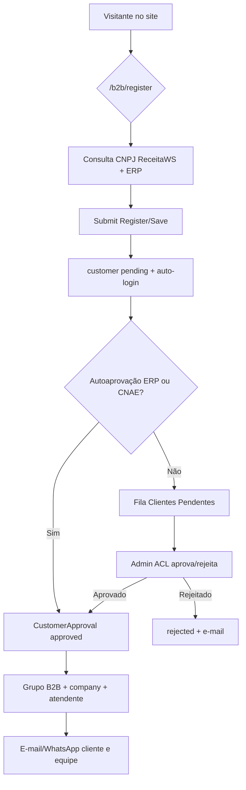
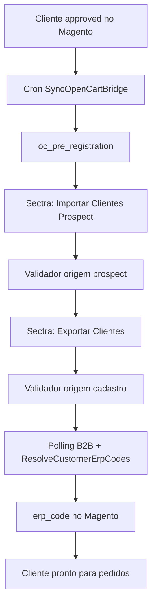
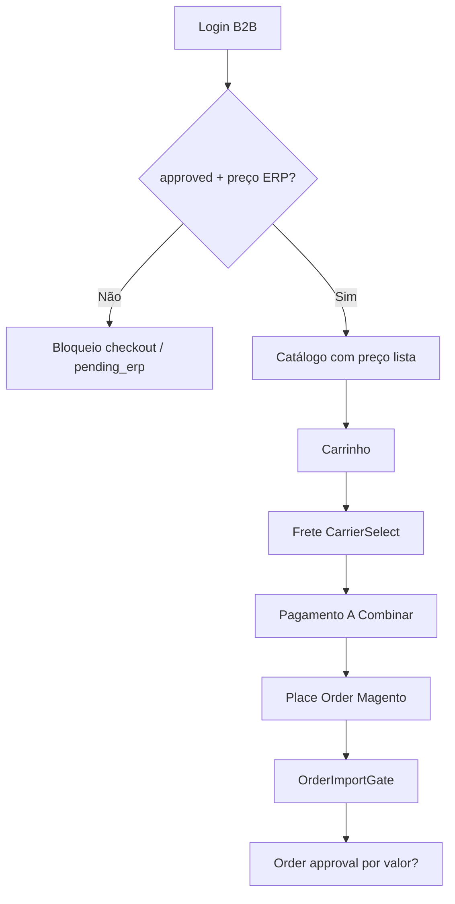
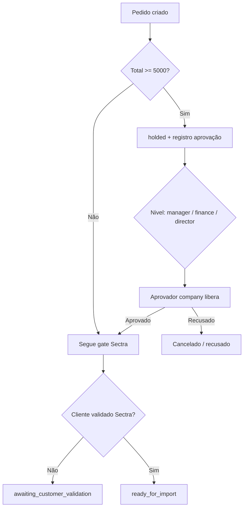
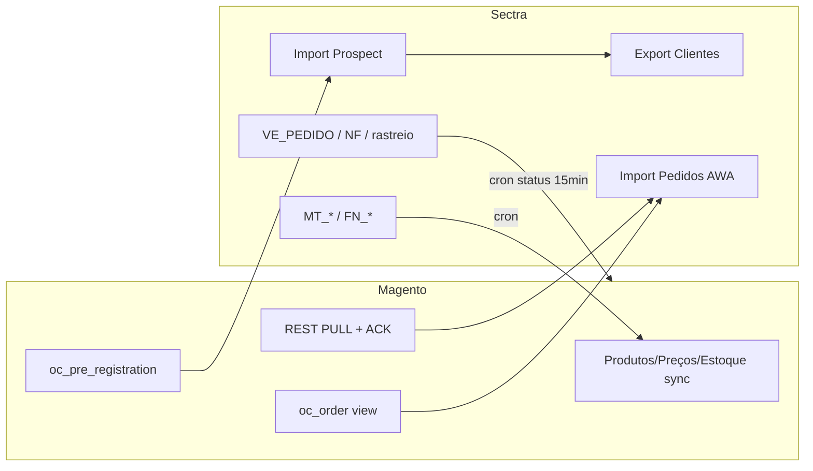
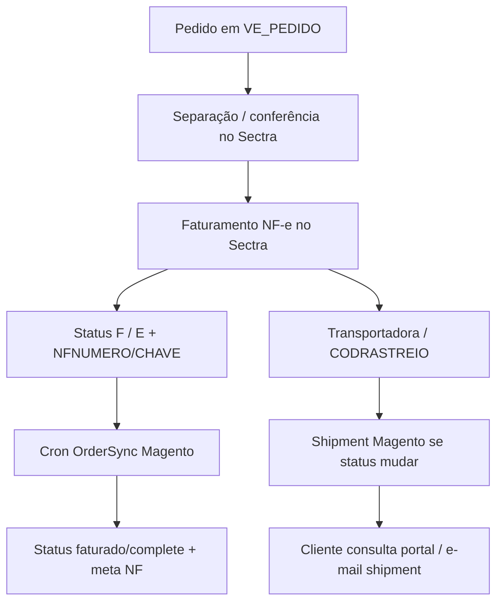
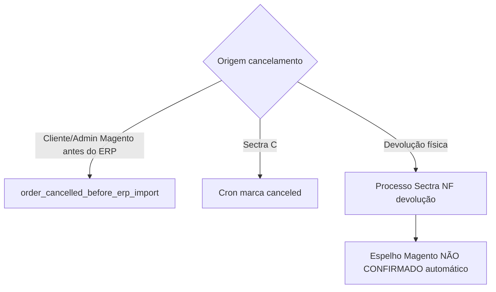
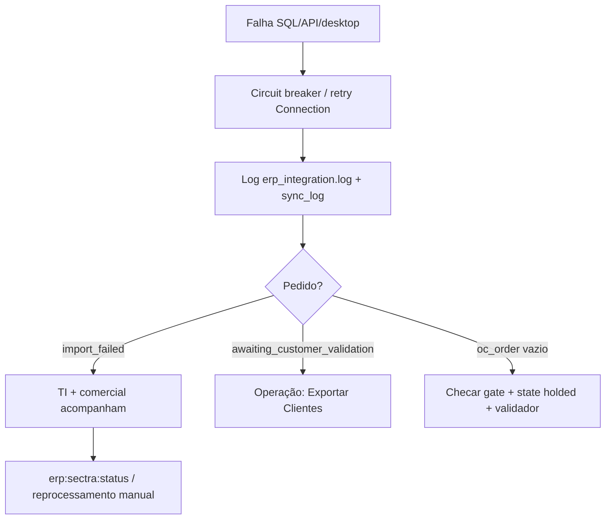

# Mapa Operacional B2B — Magento 2 × ERP Sectra

**Data da auditoria:** 2026-07-16
**Escopo:** somente leitura (código, configuração, banco, diagnósticos). Nenhuma alteração em produção.
**Ambiente:** Magento Open Source 2.4.8-p3 · `GrupoAwamotos_B2B` · `GrupoAwamotos_ERPIntegration` · PHP 8.4
**Legenda de evidência:**

| Marcador | Significado |
| -------- | ----------- |
| CONFIRMADO NO SISTEMA | Valor/contagem lidos de `core_config_data`, tabelas Magento ou CLI |
| CONFIRMADO NO CÓDIGO | Comportamento implementado em `app/code/GrupoAwamotos/*` |
| CONFIRMADO POR CONFIGURAÇÃO | Path Magento ativo/inativo |
| INFERIDO | Conclusão lógica a partir de evidências, sem prova operacional direta |
| NÃO ENCONTRADO | Busca sem resultado |
| NÃO CONFIRMADO — NECESSITA VALIDAÇÃO | Depende de processo humano, desktop Sectra ou decisão de negócio |

---

## 1. Resumo executivo

A operação B2B da AWA Motos roda em **Magento Community com B2B customizado** (não Adobe Commerce B2B). O visitante navega o catálogo público, mas **não vê preço útil, não compra e não solicita cotação**. O cadastro PJ ocorre em `/b2b/register`, cria **cliente Magento com status `pending`**, e a compra só é liberada após **aprovação comercial** (`approved`) e vínculo com **tabela de preços do ERP**.

A integração com o Sectra é **híbrida e majoritariamente PULL**:

1. Catálogo, preços, estoque, clientes existentes e títulos: **Sectra → Magento** (cron).
2. Novos clientes: Magento publica prospect em `oc_pre_registration` → desktop Sectra **Importar Clientes Prospect** → **Exportar Clientes** → código ERP volta por polling.
3. Pedidos: Magento marca `sectra_import_status` → bridge `oc_order` / API PULL → desktop Sectra **Importar Pedidos AWA**. Push automático por fila está **desligado** (`sync_orders/send_on_place=0`, `use_queue=0`).

### Números observados (CONFIRMADO NO SISTEMA — 2026-07-16)

| Indicador | Valor |
| --------- | ----- |
| Clientes `approved` | 8.913 |
| Clientes `pending` | 38 (36 com >48h) |
| Clientes `rejected` / `suspended` | 1 / 1 |
| Atendentes ativos | 133 de 135 |
| Vínculos cliente↔atendente | 8.915 |
| Empresas (`grupoawamotos_b2b_company`) | 14 (papéis só `admin`) |
| Clientes mapeados ERP | 9.803 |
| Clientes no validador Sectra (cadastro) | 1.306 |
| Gap validador (~) | ~86,7% dos B2B Magento sem registro completo |
| Pedidos em `oc_order` agora | 0 |
| Prospects disponíveis p/ Sectra | 1 |
| Fila Exportar Clientes | 96 |
| Crédito B2B no Magento | **desligado** (`credit/enabled=0`) |
| Cotação no storefront | **desligada** (`quote_request/enabled=0`) |
| Pedido mínimo | **desligado** (`minimum_qty/enabled=0`) |
| Pagamento ativo observado | `acombinar` (A Combinar) |
| Frete ativo observado | `carrierselect` (transportadora a escolher) |

### Principais riscos

1. **Gap massivo de validação Sectra** — muitos clientes aprovados no Magento ainda não estão no validador de cadastro; pedidos ficam em `awaiting_customer_validation` ou bridge vazia.
2. **Dependência operacional do desktop Sectra** — ordem obrigatória: Exportar Clientes → Importar Pedidos. Sem disciplina, o e-commerce “parece” que pediu e o ERP não importa.
3. **Aprovação financeira/fiscal no Magento é parcial** — há hold por valor (gerente/financeiro/diretor), mas **crédito Magento está desligado** e **não há bloqueio por títulos vencidos no checkout** (código só exibe títulos).
4. **Vazamento de preço no HTML/JSON-LD** da PDP pública apesar do modo strict.
5. **E-mails departamentais concentrados** — notificações de cadastro vão para `b2b.awamotos@gmail.com` e identidade geral `contato@awamotos.com.br`; não há caixas `financeiro@`, `fiscal@`, etc. configuradas no Magento.
6. **Empresa multi-usuário pouco adotada** — 14 companies vs milhares de clientes; papéis `manager`/`buyer` praticamente não usados.
7. **Documentação legada diverge do runtime** — alguns READMEs ainda falam em push/fila e tabelas antigas.

### Pontos que precisam de decisão da direção

Ver seção 17. Em destaque: quem aprova crédito de fato (Magento vs Sectra); SLA de cadastro; se crédito faturado deve ser reativado; se cotação deve voltar; política de caixas de e-mail; obrigatoriedade do fluxo Exportar Clientes; se o Magento deve ser fonte ou espelho de cadastro.

---

## 2. Arquitetura dos sistemas

```text
[Visitante / Comprador B2B]
        │ HTTPS
        ▼
[Nginx + Magento 2.4.8-p3]
  ├─ GrupoAwamotos_B2B          (cadastro, aprovação, preços, empresa, crédito*, pedido)
  ├─ GrupoAwamotos_BrazilCustomer (atributos CPF/CNPJ legado)
  ├─ GrupoAwamotos_ERPIntegration (SQL Server + bridge oc_* + PULL API + syncs)
  ├─ GrupoAwamotos_OfflinePayment (A Combinar)
  ├─ GrupoAwamotos_CarrierSelect  (transportadora)
  ├─ Redis (cache/FPC/sessão)
  └─ OpenSearch (catálogo)
        │
        ├─ MySQL Magento (fonte operacional web + tabelas oc_*)
        │
        ├─ SQL Server Sectra (leitura contínua; escrita opcional/instável)
        │     FN_FORNECEDORES, MT_MATERIAL, MT_ESTOQUEMEDIA, MT_MATERIALLISTA,
        │     VE_PEDIDO, FN_RECEBER, GR_INTEGRACAOVALIDADOR, ...
        │
        └─ Desktop Sectra (PULL operacional)
              Importar Clientes Prospect ← oc_pre_registration
              Exportar Clientes          → GR_INTEGRACAOVALIDADOR (origem cadastro)
              Importar Pedidos AWA       ← oc_order / REST PULL

[WhatsApp Z-API]  ← notificações equipe (config habilitada)
[ReceitaWS]       ← consulta CNPJ no cadastro
```

\* Crédito implementado no código, **desabilitado por configuração**.

**NÃO ENCONTRADO:** Adobe Commerce Company / Shared Catalog / Negotiable Quote / Purchase Order.
**NÃO ENCONTRADO:** sync PIX Magento↔Sectra.
**NÃO CONFIRMADO — NECESSITA VALIDAÇÃO:** CRM comercial externo além do painel B2B Magento + Sectra.

---

## 3. Fluxo atual — AS IS

### 3.1 Cadastro

1. Visitante acessa site (catálogo público).
2. Clica em cadastro (`/b2b/register`, header, login, landing `/seja-revendedor`).
3. Preenche PJ em 4 etapas; CNPJ consulta ReceitaWS + checagem ERP.
4. `Register/Save` cria `customer_entity` com `b2b_approval_status=pending`, grupo pendente, login automático.
5. Admin (ACL `customer_approval`) ou autoaprovação (CNPJ já no ERP / CNAE direto) aprova.
6. Ao aprovar: grupo B2B, criação de company, atribuição de atendente, tentativa de link ERP, e-mail/WhatsApp.
7. Bridge cron publica prospect; Sectra importa; Exportar Clientes valida; polling devolve `erp_code`.

### 3.2 Pedido

1. Cliente aprovado com preço ERP adiciona itens e finaliza (pagamento tipicamente A Combinar; frete CarrierSelect).
2. Pedido nasce no Magento; gate Sectra define `sectra_import_status`.
3. Se valor ≥ limiares, entra fluxo de aprovação interna (hold).
4. Quando `ready_for_import` + cliente validado, aparece em `oc_order`.
5. Sectra importa, fatura, baixa estoque, rastreia — retorno de status/NF/rastreio para Magento por cron (15 min status).

### 3.3 O que NÃO está ativo hoje (CONFIRMADO POR CONFIGURAÇÃO)

- Crédito Magento / faturamento como método de pagamento (`credit/enabled=0`)
- Cotação storefront (`quote_request/enabled=0`)
- Pedido mínimo (`minimum_qty/enabled=0`)
- Quick order (`features/quick_order_enabled=0`)
- Push automático de pedido (`send_on_place=0`, `use_queue=0`)
- Guest checkout (`checkout/options/guest_checkout=0`)

---

## 4. Fluxo recomendado — TO BE

Separação clara: **já existe** vs **recomendação**.

| Área | Já existe | Recomendação TO BE |
| ---- | --------- | ------------------ |
| Cadastro PJ + CNPJ | Sim | Formalizar SLA 24–48h; fila por departamento |
| Autoaprovação ERP/CNAE | Sim (config) | Manter para clientes já no Sectra; demais com checklist |
| Validação Sectra | Manual desktop | Runbook diário + alerta quando fila Exportar Clientes > 0 e pedidos retidos |
| Crédito | Código Magento off; limite lido do ERP | Decidir fonte oficial; se Sectra, espelhar e bloquear checkout por limite/títulos |
| Aprovação pedido por valor | Sim (5k/15k/50k) | Completar papéis company + notificação real ao aprovador |
| Financeiro/fiscal | Parcial / NÃO CONFIRMADO no Magento | Aprovar crédito/títulos no Sectra; Magento só espelha status |
| E-mails departamentais | Concentrados | Criar caixas e roteamento (seção 14) |
| Multi-usuário empresa | Código existe, adoção baixa | Ativar papéis admin/manager/buyer no onboarding |
| Cotação | Código existe, feature off | Reativar se comercial usar orçamento formal |
| Integração pedido | PULL desktop | Manter PULL até escrita SQL estável; depois avaliar push idempotente |
| Pós-venda | Magento status + boleto leitura | Padronizar RMA/devolução no Sectra e espelho Magento |

---

## 5. Jornada do visitante

| # | Pergunta | Resposta | Evidência |
| - | -------- | -------- | --------- |
| 1 | Páginas públicas | Home, categorias, PDP (não exclusivos), conteúdo CMS, login/cadastro | HTTP/config mode strict |
| 2 | Vê produtos? | Sim, exceto exclusivos B2B/OEM | Plugins Restricted* |
| 3 | Vê preços? | Visualmente não (`hide_price_guests=1`); **vaza** em JSON-LD/HTML | PriceVisibility + Theme JSON-LD |
| 4 | Consulta estoque? | Status “Em estoque” na PDP pública; qty exata NÃO CONFIRMADO para guest | PDP / StockPlugin |
| 5 | Monta carrinho? | Página carrinho acessível; add-to-cart bloqueado no storefront | BlockCartAddPlugin; guest_checkout=0 |
| 6 | Solicita orçamento? | Não (`quote_request/enabled=0`, `allow_guests=0`) | core_config_data |
| 7 | Ações que exigem login | Preço, compra, checkout, cotação, listas, crédito/financeiro | CheckoutAccessValidator / plugins |
| 8 | Onde cadastra | `/b2b/register`; links no header, login, landing, catálogo | templates tema + B2B |

---

## 6. Jornada do novo cliente

### 6.1 Campos e validações (CONFIRMADO NO CÓDIGO)

Etapas do formulário (`b2b/register`):

1. **Empresa:** CNPJ, razão social, nome fantasia, IE/isento, telefone/WhatsApp
2. **Endereço:** CEP, logradouro, número, complemento, bairro, cidade, UF
3. **Contato:** nome, sobrenome, e-mail
4. **Segurança:** senha, confirmação, aceite de termos

Validações: dígitos CNPJ, e-mail único, CNPJ único, senha, endereço/UF, CSRF, honeypot, rate limit.
Consulta CNPJ: ReceitaWS (`cnpj_lookup/enabled=1`), situação ativa obrigatória, cache 24h, checagem ERP por CNPJ, classificação CNAE.

Inscrição estadual: campo existe; **validação fiscal SEFAZ automatizada: NÃO ENCONTRADA**.

### 6.2 O que o cadastro cria

| Artefato | Momento | Status inicial |
| -------- | ------- | -------------- |
| `customer_entity` | Submit | `b2b_approval_status=pending`, grupo B2B Pendente |
| Endereço billing/shipping | Submit | Padrão |
| Sessão login | Submit | Auto-login |
| Company | Na aprovação | `grupoawamotos_b2b_company` + user `admin` |
| Atendente | Na aprovação | Via VENDPREF ERP ou menor carga |
| Prospect Sectra | Cron bridge ≤5 min após aprovado | `oc_pre_registration` |
| Código ERP definitivo | Após Exportar Clientes + sync | `erp_code` / entity_map |

**Fonte oficial de código de cliente:** Sectra (`FN_FORNECEDORES.CODIGO`) — Magento armazena espelho.
**Senha:** criada pelo próprio usuário no cadastro; não há “liberação de senha” pós-aprovação. Acesso à conta existe desde o pending, mas compra/preço ficam restritos.

### 6.3 Status reais de cadastro (CONFIRMADO NO CÓDIGO + SISTEMA)

| Status real | Label | Contagem 2026-07-16 | Compra? |
| ----------- | ----- | ------------------- | ------- |
| `pending` | Pendente de Aprovação | 38 | Não |
| `data_review` | Revisão de Cadastro | 0 observados | Não |
| `approved` | Aprovado | 8.913 | Sim (se preço ERP ok) |
| `rejected` | Rejeitado | 1 | Não |
| `suspended` | Suspenso | 1 | Não |
| `pending_erp` (estado lógico checkout) | Sem tabela ERP | — | Bloqueado |

### 6.4 Status recomendados (TO BE — não usar como verdade atual)

`cadastro_iniciado` → `aguardando_validacao_cnpj` → `aguardando_comercial` → `aguardando_financeiro` → `aguardando_fiscal` → `aguardando_integracao_sectra` → `aprovado_ativo` / `recusado` / `bloqueado` / `inativo`.

### 6.5 Notificações de cadastro

| Evento | Canal | Destino configurado |
| ------ | ----- | ------------------- |
| Novo cadastro admin | E-mail | `grupoawamotos_b2b/customer_approval/admin_email` = `b2b.awamotos@gmail.com` |
| Também general | Identidade | `contato@awamotos.com.br` / `atacado@awamotos.com.br` |
| Pendentes >48h | Cron 08:00 | Mesmo admin e-mail |
| Aprovado/rejeitado cliente | E-mail + WhatsApp (config on) | E-mail do cliente; times WhatsApp configurados |
| Lacuna | Observers em `customer_register_success` | Podem **não** disparar no fluxo `/b2b/register/save` — NÃO CONFIRMADO se e-mail de registro sempre sai |

### 6.6 Respostas pontuais 9–40 (cadastro)

| # | Resposta curta |
| - | -------------- |
| 9–10 | Campos listados em 6.1 |
| 11 | Sim, ReceitaWS |
| 12 | Sim (formato, unicidade, situação cadastral) |
| 13 | IE coletada; validação SEFAZ **NÃO ENCONTRADA** |
| 14 | Cria **cliente**; company na aprovação |
| 15 | Magento `customer_entity` + EAV B2B |
| 16 | `pending` |
| 17 | Admin e-mail B2B + WhatsApp equipe |
| 18–20 | Atendente: VENDPREF Sectra → match `erp_seller_code` → senão menor `customer_count` com `max_customers`; **não** por cidade/CNAE automático (CNAE só grupo/autoaprovação) |
| 21–22 | Admin Magento com ACL aprovação; autoaprovação se CNPJ no ERP ou CNAE direto |
| 23–25 | Financeiro/crédito/fiscal no Magento para cadastro: **NÃO CONFIRMADO como etapa obrigatória** (crédito Magento off) |
| 26–28 | Enviado ao Sectra como prospect **após aprovação**; código definitivo no Sectra |
| 29 | Sectra fonte de código/crédito/preço; Magento fonte do login web |
| 30 | Polling `ResolveCustomerErpCodes` (3h) + syncs |
| 31–32 | Login/senha no submit; compra só após approved |
| 33 | Templates: admin_new_customer, registration_*, customer_approved/rejected, pending_approvals |
| 34–36 | Rejected; correção via admin/data_review (ação `RequestReview` aparenta quebrada no código) |
| 37 | SLA formal **NÃO CONFIRMADO**; 36/38 pendentes >48h |
| 38 | Grid Clientes Pendentes + e-mail diário 08h |
| 39–40 | Após approved: preços da lista ERP (`FATORPRECO` / `MT_MATERIALLISTA`); condições comerciais do ERP |

---

## 7. Jornada do cliente existente

| # | Tema | AS IS |
| - | ---- | ----- |
| 1 | Login | `/b2b/account/login` (padrão Magento redireciona) |
| 2 | Recuperação | `/b2b/account/forgotpassword` |
| 3–4 | Validação / empresa | Customer Magento; company se existir (baixa adoção) |
| 5 | Vendedor | `grupoawamotos_b2b_customer_attendant` + painel comercial |
| 6–8 | Papéis | Código: `admin`, `manager`, `buyer`; uso real quase só admin |
| 9–12 | Catálogo/preço/imposto | Preço ERP; imposto Magento padrão BR — detalhe ST/DIFAL **NÃO CONFIRMADO no Magento** |
| 13–14 | Estoque/prazo | Estoque Sectra (sync 30 min + plugin); prazo entrega **NÃO CONFIRMADO** automatizado |
| 15–17 | Crédito/títulos/bloqueio | Limite lido do ERP; módulo crédito Magento **off**; títulos exibidos; bloqueio checkout por vencidos **NÃO ENCONTRADO** |
| 18–19 | Mínimo/múltiplos | Mínimo off; múltiplos **NÃO CONFIRMADO** global |
| 20 | Pagamento | `acombinar` ativo; crédito B2B config off |
| 21–22 | Endereços | Customer address Magento; sync de endereços ERP em CustomerSync |
| 23–32 | Carrinho→pedido | Carrinho Magento; cotação off; quick order off; shopping lists existem; frete CarrierSelect; place order Magento |

Claim de conta ERP offline: `/b2b/account/claim` (CONFIRMADO NO CÓDIGO).

---

## 8. Fluxo interno do pedido

### Perguntas-chave

| Pergunta | Resposta AS IS | Evidência |
| -------- | -------------- | --------- |
| Nasce aprovado ou pendente? | Em geral `processing`/`pending`; pode ir a `holded` se ≥ limiar aprovação | order_approval enabled |
| Magento reserva estoque? | `manage_stock` tende desligado; ERP autoridade — **reserva Magento NÃO CONFIRMADA** | ProductSync/StockSync comments |
| Enviado imediatamente ao Sectra? | Não push; fica disponível para PULL se gate OK | send_on_place=0 |
| Cron? | Sim (bridge 5 min, status 15 min, prospect 15 min, etc.) | crontab.xml |
| Fila/consumer? | Implementados, **inativos** para auto-envio | use_queue=0 |
| API tempo real? | REST PULL + ACK; não push on place | webapi.xml |
| Frequência | Ver matriz seção 13 | — |
| Aguarda aprovação? | Sim se ≥ R$5.000 / 15.000 / 50.000 | config |
| Quem aprova? | Papéis company manager/financeiro/diretor — **adoção e eficácia admin NÃO CONFIRMADAS** | OrderApprovalService |
| Vendedor valida? | Não obrigatório no código de gate | — |
| Financeiro no Magento ou Sectra? | Hold Magento por valor; crédito/títulos efetivos **provavelmente Sectra** — NÃO CONFIRMADO processo humano |
| Limite crédito / títulos | Código crédito off; títulos sem bloqueio checkout | — |
| Aprovação fiscal | NÃO ENCONTRADA no Magento | — |
| Confirmação e-mail cliente | Magento order e-mail identity `general` — **antes** do ERP import | sales_email/order |
| Status oficial | Operação física: **Sectra**; vitrine: Magento espelha | OrderSync mapping |
| Retorno status | Cron `*/15` lê `VE_PEDIDO` A/P/F/E/C/D | OrderSync |

### Aprovações possíveis

#### Comercial (parcialmente no Magento)

| Caso | Sistema | Status | Responsável | Observação |
| ---- | ------- | ------ | ----------- | ---------- |
| Valor ≥ 5k/15k/50k | Magento | holded + order_approval | manager/finance/director | Tabela vazia hoje (0 rows) |
| Preço fora tabela | Sectra / comercial | NÃO CONFIRMADO Magento | Vendedor/supervisor | ERP autoridade de preço |
| Cliente sem vendedor | Magento | Atribuição na aprovação | AttendantManager | Fallback load-balance |
| Produto restrito | Magento | Bloqueio view/collection | Sistema | Plugins Restricted* |

#### Financeira

| Caso | Sistema AS IS | Observação |
| ---- | ------------- | ---------- |
| Limite insuficiente | Magento código existe, **feature off**; ERP tem VLRLIMCREDITO | NÃO CONFIRMADO bloqueio checkout |
| Títulos vencidos | Magento exibe; **não bloqueia** | CustomerFinanceData |
| Pagamento faturado | Método crédito off; usa A Combinar | OfflinePayment |
| Cliente bloqueado | `suspended` / rejected | ApprovalStatus |

#### Fiscal

| Caso | AS IS |
| ---- | ----- |
| IE, ST, DIFAL, natureza | **NÃO ENCONTRADO** workflow Magento; esperado no Sectra na emissão |

#### Estoque

| Caso | AS IS |
| ---- | ----- |
| Falta / parcial / descontinuado | Sectra na separação/faturamento; Magento pode mostrar disponibilidade via plugin |
| Divergência Magento×Sectra | Risco real (sync 30 min + manage_stock false) |

---

## 9. Fluxos em Mermaid

### 9.1 Cadastro de novo cliente



### 9.2 Aprovação cadastral + Sectra



### 9.3 Cliente existente realizando pedido



### 9.4 Aprovação financeira / valor



### 9.5 Integração Magento–Sectra



### 9.6 Faturamento e expedição



### 9.7 Cancelamento e devolução



### 9.8 Falha de integração



---

## 10. Tabela de status

| Processo | Status | Sistema | Responsável | Próxima ação | SLA sugerido |
| -------- | ------ | ------- | ----------- | ------------ | ------------ |
| Cadastro | pending | Magento | Comercial/Cadastro | Analisar grid pendentes | 48h (alerta cron já existe) |
| Cadastro | approved | Magento | — | Aguardar bridge/Sectra | — |
| Cadastro | rejected/suspended | Magento | Comercial | Comunicar cliente | 24h |
| Prospect | em oc_pre_registration | Magento→Sectra | Operação ERP | Importar Prospect | Diário |
| Cliente ERP | sem validador cadastro | Sectra | Operação ERP | Exportar Clientes | Diário / antes de pedidos |
| Pedido | awaiting_customer_validation | Magento | Operação ERP | Validar cliente | 4h útil |
| Pedido | ready_for_import | Magento | Operação ERP | Importar Pedidos AWA | 2h útil |
| Pedido | imported | Magento/Sectra | — | Separar/faturar | — |
| Pedido | import_failed | Magento | TI + Operação | Diagnosticar | 2h |
| Pedido | holded (aprovação valor) | Magento | Aprovador company | Aprovar/recusar | 24h |
| Pedido ERP | W/P/F/E/C/D | Sectra | Operação | Fluxo interno | Conforme política interna |
| VE_PEDIDO W | Aguardando importação | Sectra | Operação | Concluir import | NÃO CONFIRMADO |

---

## 11. Matriz RACI

### 11.1 AS IS (evidência de sistema — papéis humanos inferidos com cautela)

| Processo | Cliente | Vendedor/Atendente | Comercial Admin | Financeiro | Fiscal | Estoque/Expedição | TI | Sectra Op. |
| -------- | ------- | ----------------- | --------------- | ---------- | ------ | ----------------- | -- | ---------- |
| Preencher cadastro | R | I | I | — | — | — | — | — |
| Aprovar cadastro Magento | I | C | R/A | NÃO CONFIRMADO | NÃO CONFIRMADO | — | C | — |
| Vincular vendedor | I | I | A (sistema/auto) | — | — | — | C | C (VENDPREF) |
| Importar prospect | — | — | I | — | — | — | C | R/A |
| Exportar clientes | — | — | I | — | — | — | C | R/A |
| Criar pedido | R | I | I | — | — | — | — | — |
| Aprovação por valor | C | C | A/R (papéis) | A (≥15k config) | — | — | — | — |
| Importar pedido ERP | I | I | I | C | C | C | C | R/A |
| Faturar / NF | I | I | I | C | R/A | C | — | R |
| Separar / expedir | I | I | I | — | — | R/A | — | R |
| Falha integração | I | I | C | — | — | — | R/A | C |

R=executa A=aprova C=consultado I=informado

### 11.2 TO BE recomendada

| Processo | Cadastro | Comercial | Crédito | Fiscal | Faturamento | Expedição | E-commerce | TI | Diretoria |
| -------- | -------- | --------- | ------- | ------ | ----------- | --------- | ---------- | -- | --------- |
| Aprovar CNPJ/dados | R | A | C | C | — | — | I | C | — |
| Aprovar crédito | C | C | R/A | C | — | — | I | — | A (exceção) |
| Pedido padrão | — | I | I | — | — | — | I | — | — |
| Pedido exceção | — | R | A | C | — | — | I | — | A |
| Integração diária | — | I | — | — | I | I | R | A | I |

---

## 12. Matriz de permissões

| Perfil | Magento | Sectra | Visualiza | Altera | Aprova | Exporta | Dados restritos |
| ------ | ------- | ------ | --------- | ------ | ------ | ------- | --------------- |
| Cliente buyer | Front | Não | Catálogo/preço próprio, pedidos | Carrinho/endereço | Pedidos se papel | Não | Outros clientes |
| Admin empresa | Front | Não | Usuários company | Usuários/papéis | Pedidos nível | Não | — |
| Vendedor/atendente | Admin painel comercial (se ACL) | Sim carteira | Clientes da carteira | Follow-up | Cadastro se ACL | Relatórios | Custo |
| Cadastro | Admin clientes | Consulta | Pendentes | Dados cadastrais | Cadastro | Listas | — |
| Financeiro/crédito | Admin crédito* / pedidos | Sim títulos | Limites/títulos | Limite* | Crédito/valor | Títulos | — |
| Fiscal | Consulta | Sim | Cadastro fiscal | Natureza/IE no ERP | Liberação fiscal ERP | — | Docs fiscais |
| Faturamento | Pedidos/NF meta | Sim | Pedidos | NF | — | NF | Chaves NF |
| Expedição | Shipments | Sim | Pedidos prontos | Rastreio | — | Romaneio | — |
| Atendimento | Pedidos/clientes | Consulta | Status | Comentários | Não financeiro | — | — |
| TI | Admin + CLI + logs | Conexão | Tudo técnico | Config/integração | — | Logs | Credenciais |
| Diretoria | Dashboards | Relatórios | KPIs | Metas | Exceções | — | — |

\* Crédito Magento atualmente desabilitado — acesso existe no menu/código.

**Lacunas de segurança observadas / a validar:**

- Menor privilégio e 2FA admin: NÃO CONFIRMADO nesta auditoria
- Separação cadastro×crédito×fiscal: **não materializada** em workflow Magento
- Vazamento preço JSON-LD público: confirmado no código/tema

---

## 13. Matriz de integrações

| Informação | Origem | Destino | Direção | Frequência | Gatilho | Fonte oficial | Tratamento de erro |
| ---------- | ------ | ------- | ------- | ---------- | ------- | ------------- | ------------------ |
| Produtos/SKU | Sectra MT_MATERIAL | Magento | S→M | */6h | Cron | Sectra | Log sync; desativa ausentes |
| Categorias | MT_GRUPOCOMERCIAL | Magento | S→M | 4×/dia | Cron | Sectra | Log |
| Preços lista | MT_MATERIALLISTA | Magento | S→M | 4h full + 5min delta | Cron | Sectra | Cache/retry |
| Preço cliente | FATORPRECO / lista | Magento runtime | S→M | Cache + warm 4h | Request/cron | Sectra | pending_erp |
| Estoque | MT_ESTOQUEMEDIA | Magento | S→M | 30 min + plugin | Cron/request | Sectra | Circuit breaker |
| Clientes existentes | FN_FORNECEDORES | Magento | S→M | Diário 02:00 | Cron | Sectra | Map/hash |
| Prospect novo | Magento approved | oc_pre_registration → Sectra | M→S | ≤5 min | Cron bridge | Magento (lead) / Sectra (código) | Status CLI |
| Validador cadastro | Sectra Exportar | GR_INTEGRACAOVALIDADOR | S | Manual desktop | Operador | Sectra | Pedidos retidos |
| Código cliente | Sectra | Magento erp_code | S→M | 3h + polls | Cron | Sectra | Retry held |
| Limite crédito | VLRLIMCREDITO | Magento | S→M | No customer sync | Cron | Sectra | Placeholder dívida |
| Títulos/boletos | FN_RECEBER* | Magento leitura | S→M | On demand | Portal | Sectra | Só STATUS=A |
| Pedidos | Magento | oc_order / PULL / VE_PEDIDO | M→S | Bridge 5 min; import manual | Gate+desktop | Magento cria; Sectra opera | import_failed; ACK |
| Status pedido | VE_PEDIDO | Magento status | S→M | 15 min | Cron | Sectra | Sem mudança W/T |
| NF meta | VE_PEDIDO | Magento | S→M | Com status | Cron | Sectra | Sem XML oficial |
| Rastreio | CODRASTREIO | Shipment Magento | S→M | Com mudança status | Cron | Sectra | Pode atrasar se só rastreio muda |
| Cancelamento | Ambos | Ambos | Bi | Evento | User/ERP | Depende do momento | order_cancelled_before_erp_import |
| PIX | — | — | — | — | — | NÃO ENCONTRADO | — |
| Transportadora preferencial | ERP cliente | Magento | S→M | Customer sync | Cron | Sectra | CarrierSelect no checkout |
| Vendedores | Sectra VENDPREF + tabela attendants | Magento | S→M / M interno | Sync 03:00 | Cron | Sectra preferencial | Fallback load-balance |

---

## 14. E-mails departamentais

### 14.1 Situação atual (CONFIRMADO NO SISTEMA)

| Identidade / path | E-mail |
| ----------------- | ------ |
| general / sales / vários | `contato@awamotos.com.br` |
| custom2 / contato form | `atacado@awamotos.com.br` |
| support | `suporte@awamotos.com.br` |
| Notificação aprovação B2B | `b2b.awamotos@gmail.com` |
| WhatsApp equipe B2B/vendas | Números comerciais configurados (Z-API) |

### 14.2 Recomendados (TO BE)

| Endereço | Finalidade | Tipo | Mensagens | Magento | Sectra | SLA |
| -------- | ---------- | ---- | --------- | ------- | ------ | --- |
| cadastro@ | Novos CNPJ / pendências | Grupo | Novo cadastro, incompleto | Sim (admin_email) | Não | 48h |
| vendas@ / atacado@ | Comercial geral | Grupo | Pedidos, dúvidas | Parcial (já atacado@) | Não | 4h |
| credito@ | Limite / inadimplência | Grupo | Bloqueios, liberação | Futuro | Sim | 4h útil |
| financeiro@ | Títulos, boletos, conciliação | Grupo | Cobrança | Leitura portal | Sim | 8h |
| fiscal@ | IE, ST, NF | Grupo | Divergências fiscais | Não | Sim | 8h |
| faturamento@ | NF / erros emissão | Grupo | NF incorreta | Meta NF | Sim | 4h |
| pedidos@ | Fila importação | Grupo | Pedidos retidos | Alertas gate | Desktop | 2h |
| expedicao@ / logistica@ | Envio / rastreio | Grupo | Despacho | Shipment e-mail | Sim | Dia |
| atendimento@ / posvenda@ | SAC / devolução | Grupo | Cancel/devolução | Pedidos | Sim | 24h |
| ecommerce@ | Catálogo/preço site | Grupo | Bug vitrine | Admin | — | 8h |
| ti@ | Integração | Grupo | Cron/fila/API | Logs | Conexão | 1h crítico |

**Não criar contas nesta etapa** — apenas planejamento.

---

## 15. Plano de treinamento

| # | Módulo | Público | Sistema | Duração | Exercício | Reciclagem |
| - | ------ | ------- | ------- | ------- | --------- | ---------- |
| 1 | Visão operação B2B | Todos | — | 2h | Quiz fluxo | Anual |
| 2 | Cadastro e aprovação | Cadastro/Comercial | Magento Admin pendentes | 2h | Aprovar case teste | Semestral |
| 3 | Vendedores e carteiras | Comercial | Attendants + Sectra VENDPREF | 1,5h | Reatribuir cliente | Semestral |
| 4 | Preços e condições | Comercial/E-commerce | Magento+listas ERP | 2h | Conferir preço SKU | Semestral |
| 5 | Pedidos Magento | Atendimento/Comercial | Front + Admin orders | 2h | Pedido ponta a ponta | Semestral |
| 6 | Aprovação financeira | Financeiro/Crédito | Sectra + hold Magento | 2h | Liberar/bloquear | Semestral |
| 7 | Operação Sectra B2B | Operação ERP | Desktop Import/Export | 3h | Importar prospect+pedido | Trimestral |
| 8 | Estoque e separação | Estoque | Sectra | 2h | Separação parcial | Semestral |
| 9 | Faturamento | Fiscal/Faturamento | Sectra NF | 2h | Emitir/consultar DANFE | Semestral |
| 10 | Expedição | Expedição | Sectra+Magento shipment | 1,5h | Rastreio | Semestral |
| 11 | Atendimento/pós-venda | SAC | Magento+Sectra | 2h | Cancel/devolução | Semestral |
| 12 | Erros de integração | TI + Operação | CLI `erp:sectra:status`, logs | 3h | Diagnosticar oc_order=0 | Trimestral |
| 13 | Segurança/LGPD | Todos com acesso | Políticas | 1h | Checklist acesso | Anual |
| 14 | Indicadores | Gestão | Dashboards | 1,5h | Ler SLA | Semestral |

Responsável por ministrar: **NÃO CONFIRMADO — NECESSITA VALIDAÇÃO** (sugerido: E-commerce + TI + líder Sectra).

---

## 16. Exceções e falhas

| Falha | Causa provável | Detecção | Sistema | Responsável | Correção | Impacto |
| ----- | -------------- | -------- | ------- | ----------- | -------- | ------- |
| CNPJ duplicado | ReCadastro | ValidateCnpj | Magento | Cadastro | Usar claim/conta existente | Cadastro bloqueado |
| Cliente só Sectra | Sync incompleto | Diagnóstico gap | Ambos | TI/Cadastro | CustomerSync / map | Sem login web |
| Cliente só Magento | Não Exportar Clientes | erp:sectra:status | Ambos | Operação ERP | Exportar Clientes | Pedido não importa |
| Sem vendedor | VENDPREF vazio | Attendant null | Magento | Comercial | Atribuir manual | Carteira órfã |
| Preço divergente | Cache/lista | Comparar ERP×PDP | Ambos | E-commerce | Flush cache preço | Margem/reclamação |
| Estoque divergente | Lag 30 min | Plugin vs físico | Ambos | Estoque | Re-sync / priorizar ERP | Ruptura |
| Pedido duplicado | Retry push não idempotente | VE_PEDIDO | Sectra | TI | Evitar push; usar ACK | Duplicidade |
| Cron parado | Scheduler | cron_schedule | Magento | TI | Reiniciar cron | Parada sync |
| Fila parada | Consumers off | queue tables | Magento | TI | Hoje irrelevante (fila off) | — |
| API/SQL down | Rede/credencial | Circuit breaker | Magento | TI | Abrir breaker; fallback | Site/ERP |
| Pedido parcial | Import incompleto | import_failed | Ambos | TI/Operação | Reimport | Atraso |
| Status não retorna | Cron status | Status parado | Magento | TI | Rodar sync status | Cliente desinformado |
| Aprovado ERP / pendente Magento | Espelho atrasado | VE_PEDIDO vs sales_order | Ambos | TI | Sync status | Confusão |
| Cancel só um lado | Falta sincronismo | Diff status | Ambos | Atendimento | Alinhar cancel | Jurídico/estoque |
| NF sem Magento | Meta não sync | Sem NFCHAVE | Magento | Faturamento/TI | Re-sync order | Portal sem NF |
| 86% sem validador | Processo Exportar | Status CLI | Sectra | Gestão/Operação | Campanha regularização | Risco sistêmico |
| RequestReview quebrado | Método ausente | Admin action | Magento | TI | Corrigir código (fora desta etapa) | data_review inutilizado |
| Observers register_success | Evento não dispara no B2B save | Logs e-mail | Magento | TI | Validar e-mails reais | Notificação falha |

---

## 17. Pendências de decisão

1. Quem é o **aprovador oficial de cadastro** (pessoa/função) além da ACL técnica?
2. Crédito e inadimplência: **bloqueio no Magento, só no Sectra, ou ambos**?
3. Reativar `credit/enabled` e pagamento faturado?
4. Reativar cotações (`quote_request`)?
5. Pedido mínimo e múltiplos de venda: política comercial?
6. Manter PULL desktop como padrão ou investir em push SQL idempotente?
7. Meta de regularização do gap 86% validador — prazo e dono?
8. Caixas de e-mail departamentais: quais criar e quem acessa?
9. Papéis company (manager/buyer): tornar obrigatórios no onboarding?
10. Aprovação fiscal de cadastro: etapa formal ou só no faturamento?
11. SLA oficial por departamento (cadastro 48h, import 2h, etc.)?
12. Correção do vazamento de preço JSON-LD: prioridade?
13. WhatsApp Z-API: política de números e conteúdo LGPD?
14. Fonte oficial de endereço fiscal vs endereço de entrega?

---

## 18. Plano de implementação

### Prioridade crítica

| Ação | Motivo | Responsável sugerido | Dependências | Risco | Aceite |
| ---- | ------ | -------------------- | ------------ | ----- | ------ |
| Runbook diário Exportar Clientes → Importar Pedidos | Bridge vazia / pedidos retidos | Operação Sectra + E-commerce | Treinamento desktop | Pedidos não faturam | `oc_order` e fila export monitorados diariamente |
| Campanha reduzir gap validador | 86% clientes sem cadastro completo | Operação + Comercial | Exportar Clientes | Pedidos futuros falham | % validados sobe meta acordada |
| Definir dono de cadastros pendentes (>48h) | 36 pendentes velhos | Comercial | ACL + e-mail | Lead perdido | Fila < X em 48h |
| Validar e-mails reais do fluxo `/b2b/register` | Observers podem não disparar | TI | Logs | Equipe não vê lead | E-mail teste comprovado |

### Prioridade alta

| Ação | Motivo | Responsável | Dependências | Risco | Aceite |
| ---- | ------ | ----------- | ------------ | ----- | ------ |
| Política crédito/títulos | Feature Magento off | Diretoria Financeira | Sectra | Inadimplência | Documento aprovado |
| Corrigir vazamento preço JSON-LD | Compliance B2B | E-commerce/TI | Deploy tema | Concorrência vê preço | Guest sem price schema |
| Matriz e-mails departamentais | Concentração em Gmail/contato | TI + RH | DNS/mailbox | Falha de atendimento | Caixas ativas + roteamento |
| Completar RACI humano | Código ≠ organograma | Diretoria | Reuniões | Aprovações órfãs | RACI assinado |
| Alertas pedidos `import_failed` / `awaiting_*` | Já há casos | TI | Monitoramento | Atraso oculto | Alerta <15 min |

### Prioridade média

| Ação | Motivo | Responsável | Dependências | Risco | Aceite |
| ---- | ------ | ----------- | ------------ | ----- | ------ |
| Adotar company roles | Código pronto, 14 companies | Comercial | UX onboarding | Aprovação interna frágil | N companies com buyer/manager |
| Reativar cotação se necessário | Feature off | Comercial | Config | Orçamento informal WhatsApp | Processo cotação usado |
| Treinamentos 1–7 | Dependência desktop | E-commerce | Materiais | Erro operacional | Checklists assinados |
| Documentar fonte oficial por dado | Conflitos Magento×Sectra | TI | Seção 13 | Retrabalho | Policy publicada |

### Melhoria futura

| Ação | Motivo | Responsável | Dependências | Risco | Aceite |
| ---- | ------ | ----------- | ------------ | ----- | ------ |
| Push pedido idempotente | Menos dependência desktop | TI | Write SQL estável | Duplicidade | Pedido em VE_PEDIDO sem manual |
| Bloqueio checkout por títulos | Risco crédito | Financeiro/TI | credit on | Falso positivo | Regra testada |
| RMA/devolução espelhada | Pós-venda incompleto | SAC/TI | Sectra | Divergência | Fluxo documentado e automático |
| 2FA admin + revisão ACL | Segurança | TI | — | Credencial compartilhada | 100% users 2FA |

---

## Respostas obrigatórias (25 perguntas)

1. **Quem recebe um novo cadastro?**
   Configurado: `b2b.awamotos@gmail.com` (+ WhatsApp equipe B2B). Identidade geral `contato@awamotos.com.br`. **Pessoa física dona da caixa: NÃO CONFIRMADO — NECESSITA VALIDAÇÃO.**

2. **Quem aprova o CNPJ?**
   Usuário admin Magento com ACL `GrupoAwamotos_B2B::customer_approval`, ou autoaprovação se CNPJ já no ERP / CNAE direto (`auto_approve_if_found_in_erp=1`, `cnae_profiling/auto_approve_direct=1`).

3. **Quem aprova o crédito?**
   No Magento o módulo de crédito está **desligado**. Limite vem do Sectra (`VLRLIMCREDITO`). Aprovador humano de crédito: **NÃO CONFIRMADO — NECESSITA VALIDAÇÃO** (provável financeiro no Sectra).

4. **Quem vincula o vendedor?**
   Sistema na aprovação: VENDPREF do Sectra → atendente com `erp_seller_code`; senão load-balance por `customer_count`/`max_customers`. Ajuste manual via Admin Attendants.

5. **Quando o cliente é enviado ao Sectra?**
   Após aprovação Magento, via `oc_pre_registration` (cron bridge ~5 min). Não como insert completo em `FN_FORNECEDORES` no fluxo normal.

6. **Qual sistema gera o código do cliente?**
   **Sectra** (código definitivo). Magento espelha em `erp_code` / `grupoawamotos_erp_entity_map`.

7. **Quando o cliente recebe login e senha?**
   No submit do cadastro (cria senha e auto-login). Aprovação libera compra/preço, não a criação da senha.

8. **O cliente consegue comprar antes da aprovação?**
   **Não.** Só `approved` compra; pending sem preço (`show_price_pending=0`).

9. **Quem recebe o pedido feito no Magento?**
   Pedido fica no Magento; equipe pode ser notificada por WhatsApp (`notify_new_order=1`). E-mail sales identity = `contato@awamotos.com.br`. Importação ERP depende do operador Sectra. **Dono humano da fila: NÃO CONFIRMADO.**

10. **Quem aprova o pedido?**
    Se ≥ limiares: papéis company manager/finance/director no Magento. Abaixo: segue sem essa aprovação. Aprovação operacional/faturamento: Sectra.

11. **O financeiro aprova no Magento ou no Sectra?**
    Hold por valor pode existir no **Magento**. Crédito/títulos efetivos: **Sectra** (Magento crédito off). Processo formal: **NÃO CONFIRMADO — NECESSITA VALIDAÇÃO**.

12. **O pedido é enviado ao ERP antes ou depois da aprovação?**
    Depois do gate (cliente validado) e, se aplicável, depois de sair de `holded`. Não há push imediato no place order.

13. **O envio ocorre em tempo real, cron ou fila?**
    **Disponibilização por cron/bridge (5 min) + import manual/PULL no Sectra.** Fila Magento de push **desligada**.

14. **O que acontece quando a integração falha?**
    Status `import_failed` / pedidos retidos; logs `var/log/erp_integration.log` e tabelas sync; circuit breaker na conexão SQL; retries na Connection; **alerta departamental estruturado: NÃO CONFIRMADO**.

15. **Quem acompanha pedidos parados?**
    Tecnicamente: CLI `erp:sectra:status`, grids Magento, painel. Responsável organizacional: **NÃO CONFIRMADO — NECESSITA VALIDAÇÃO**.

16. **Quem reserva o estoque?**
    Autoridade de estoque: **Sectra**. Reserva Magento: **NÃO CONFIRMADA** (manage_stock tipicamente false).

17. **Quem fatura?**
    **Sectra** (emissão NF). Magento recebe metadados.

18. **Quem atualiza o rastreamento?**
    Gravado no Sectra; Magento sincroniza shipment/tracking no sync de status (limitação se só rastreio mudar).

19. **Como o vendedor acompanha seus próprios clientes?**
    Vínculo attendant + Commercial Panel Magento; carteira também no Sectra via VENDPREF. Detalhe de telas de uso diário: **NÃO CONFIRMADO com a equipe**.

20. **Quais departamentos precisam de acesso ao Magento?**
    E-commerce, Cadastro/Comercial (aprovação), Atendimento, Vendedores (painel), Financeiro (consulta títulos/pedidos), TI, Gestão. Fiscal/Expedição: consulta opcional.

21. **Quais departamentos precisam de acesso ao Sectra?**
    Operação ERP, Cadastro (export), Comercial, Crédito/Financeiro, Fiscal, Faturamento, Estoque, Separação, Expedição, TI (conexão), Diretoria (relatórios).

22. **Quais e-mails departamentais precisam ser criados?**
    Recomendados: cadastro@, credito@, financeiro@, fiscal@, faturamento@, pedidos@, expedicao@, logistica@, atendimento@, posvenda@, ecommerce@, ti@ — além dos já existentes contato@/atacado@/suporte@.

23. **Quais treinamentos cada departamento precisa receber?**
    Ver seção 15 (módulos 1–14 mapeados por público).

24. **Qual sistema é a fonte oficial de cada informação?**
    Ver seção 13: Sectra = produtos, preços, estoque, código cliente, crédito, títulos, NF, rastreio, status físico; Magento = identidade web, senha, carrinho, pedido web inicial, conteúdo/vitrine.

25. **Quais partes do fluxo ainda dependem de decisão humana?**
    Aprovação cadastral (quando não auto), Importar Prospect, Exportar Clientes, Importar Pedidos, aprovações por valor, liberação crédito/inadimplência no ERP, separação, faturamento, expedição, cancelamentos/devoluções, tratamento de `import_failed`, regularização do gap de validador.

---

## Apêndice A — Evidências técnicas (caminhos)

- B2B: `app/code/GrupoAwamotos/B2B/`
- ERP: `app/code/GrupoAwamotos/ERPIntegration/` + `SECTRA_INTEGRATION_AUDIT.md`
- Cadastro: `Controller/Register/Save.php`, `ValidateCnpj.php`
- Aprovação: `Model/CustomerApproval.php`, `ApprovalStatus.php`
- Gate pedido: `Model/Sectra/OrderImportGate.php`, `SectraImportStatus.php`
- Bridge: `ERPIntegration/Cron/SyncOpenCartBridge.php`
- Status CLI: `bin/magento erp:sectra:status`
- Crons: `B2B/etc/crontab.xml`, `ERPIntegration/etc/crontab.xml`

## Apêndice B — Fora de escopo / não alterado

Nenhum código, configuração, pedido, cliente, estoque, preço, cron, fila ou permissão foi modificado nesta auditoria.
