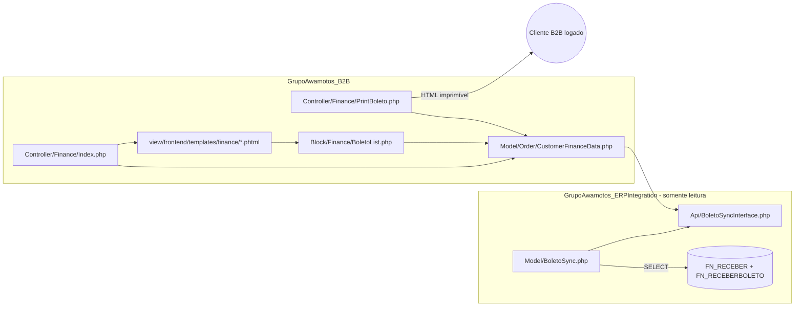

# Plano de Implementação — Boletos (Aberto/Vencido/A Vencer) + NF-e no Portal B2B

> Status: **✅ 100% IMPLEMENTADO E ATIVO EM PRODUÇÃO (2026-07-07).** Fases 1-5 concluídas, testadas e publicadas. Menu "Financeiro" visível no Portal B2B. Ver seção 7 para o registro completo da ativação.
> Escopo: exibir e imprimir, **somente para o próprio cliente logado**, os boletos em aberto/vencidos/a vencer e a NF-e, dentro do Portal B2B (`app/code/GrupoAwamotos/B2B`).
> Fonte de dados: ERP Sectra via `GrupoAwamotos\ERPIntegration` (conexão **somente leitura**).

---

## 1. Contexto

O Portal B2B já exibe **NF-e/DANFE** por pedido (referência de arquitetura reaproveitada nesta implementação):

- `app/code/GrupoAwamotos/B2B/Block/Order/ErpOperations.php`
- `app/code/GrupoAwamotos/B2B/view/frontend/templates/order/erp-operations.phtml`
- `app/code/GrupoAwamotos/B2B/Controller/Order/DownloadInvoice.php`
- `app/code/GrupoAwamotos/B2B/Model/Order/CustomerOrderErpData.php`
- `app/code/GrupoAwamotos/ERPIntegration/Model/OrderSync.php` (`getOrderInvoiceData`)

O que faltava é a parte de **boletos** (títulos financeiros), até então inexistente no B2B. O link "Minhas Faturas" no menu da conta aponta apenas para `sales/order/history` (histórico de pedidos Magento), não para uma central financeira:

- `app/code/GrupoAwamotos/B2B/view/frontend/layout/customer_account.xml`

## 2. Descobertas técnicas confirmadas no Sectra (somente leitura, via `erp:diagnose`)

| Tabela/View | Papel | Campos-chave confirmados |
|---|---|---|
| `FN_RECEBER` | Título financeiro (contas a receber) | `CODIGO` (PK), `CODCLIENTE` (→ `FN_FORNECEDORES.CODIGO`), `PEDIDO` (→ `VE_PEDIDO.CODIGO`), `DTVENCIMENTO`, `VLRDEVIDO`, `VLRTOTAL`, `DTPAGAMENTO`, `STATUS`, `CKATRASADA`, `NROBOLETO`, `NRODUPLICATA` |
| `FN_RECEBERSTATUS` | Lookup de situação | `A`=Ativas, `B`=Bloqueadas, `C`=Canceladas, `P`=Pendentes |
| `FN_RECEBERBOLETO` | Dados do boleto (chave `RECEBER` = `FN_RECEBER.CODIGO`) | `LINHADIGITAVEL`, `CODIGOBARRA` (imagem/BLOB), `LOGOTIPO` (imagem/BLOB), `NOSSONUMERO`, `CODIGOBANCO`, `CARTEIRA`, `AGENCIACODIGOCEDENTE`, `SACADONOME`, `SACADOCPFCGC`, `VALORDOCUMENTO`, `DTVENCIMENTO`, `INSTRUCOES` |
| `FN_BAIXASRECEBER` | Baixa/pagamento (bridge `BAIXA` ↔ `RECEBER`) | confirma que "pago" é registrado separadamente |
| `VW_FN_RECEBERATRASO` | View pronta de atraso | `DIAS`, `VLRJUROS`, `VLRMULTA`, `VLRDEVIDOATRASO` |

**Regra de classificação validada com dados reais:**

| Situação | Condição SQL |
|---|---|
| Aberto (geral) | `STATUS = 'A' AND DTPAGAMENTO IS NULL` |
| A vencer | acima + `DTVENCIMENTO >= GETDATE()` |
| Vencido | acima + `DTVENCIMENTO < GETDATE()` (ou `CKATRASADA = 'S'`) |
| Pago | `DTPAGAMENTO IS NOT NULL` (ou existe em `FN_BAIXASRECEBER`) |

**Importante:** não existe URL hospedada de boleto no Sectra. O boleto é montado a partir de `FN_RECEBERBOLETO` (linha digitável já pronta + imagem de código de barras já gerada pelo Sectra). Não é necessário gerar código de barras do zero — apenas exibir/imprimir os dados já existentes em layout padrão de boleto.

## 3. Arquitetura proposta (espelhando o padrão de NF-e já existente)



Princípios de segurança (mesmos já usados em `CustomerOrderErpData::getCustomerOrder`):

- Toda consulta é filtrada por `CODCLIENTE` resolvido do **cliente logado na sessão** (nunca por parâmetro livre da URL).
- Falha fechada: se não houver `erp_code`/mapeamento do cliente, não retorna nada (sem fallback permissivo).
- Nenhuma escrita no Sectra — conexão usada é a mesma `ConnectionInterface` já read-only usada hoje.
- Sem exposição de dados de outros clientes mesmo com IDs adivinhados (checagem de propriedade em toda query e no controller).

## 4. Fases de implementação

### Fase 0 — Validação e aprovação
- [x] Mapear schema Sectra (`FN_RECEBER`, `FN_RECEBERBOLETO`, `FN_RECEBERSTATUS`, `FN_BAIXASRECEBER`, `VW_FN_RECEBERATRASO`).
- [x] Confirmar regra de classificação aberto/vencido/a vencer com dados reais.
- [x] Aprovação do usuário para iniciar Fase 1 (recebida em 2026-07-07).

### Fase 1 — Camada ERPIntegration (leitura de boletos) — ✅ CONCLUÍDA (2026-07-07)
- [x] `app/code/GrupoAwamotos/ERPIntegration/Api/BoletoSyncInterface.php` criado, com constantes `SITUACAO_ABERTO`, `SITUACAO_A_VENCER`, `SITUACAO_VENCIDO`, `SITUACAO_PAGO` e os métodos:
  - `getReceivablesByErpCode(int $erpClientCode, ?string $situacao = null, int $limit = 200): array`
  - `getBoletoDetails(int $receberCodigo, int $erpClientCode): ?array`
- [x] `app/code/GrupoAwamotos/ERPIntegration/Model/BoletoSync.php` criado implementando a interface via `ConnectionInterface` (mesmo padrão de `OrderSync.php`):
  - Filtra sempre `FN_RECEBER.STATUS = 'A'` (Ativas) — Bloqueadas/Canceladas/Pendentes nunca expostas ao cliente.
  - Situação computada em PHP (`resolveSituacao`) a partir de `DTPAGAMENTO`/`DTVENCIMENTO`, testável sem depender de lógica `CASE WHEN` no SQL Server.
  - `getBoletoDetails` faz `INNER JOIN` de `FN_RECEBERBOLETO` com `FN_RECEBER` validando **CODCLIENTE E STATUS='A'** — defesa em profundidade (ver achado de hardening abaixo).
  - Não retorna as imagens binárias (`CODIGOBARRA`/`LOGOTIPO`); decisão de renderização do código de barras fica para a Fase 4.
- [x] `app/code/GrupoAwamotos/ERPIntegration/etc/di.xml` — registrada a preference `BoletoSyncInterface` → `BoletoSync` (bloco `Interface Preferences`, ao lado de `OrderSyncInterface`).
- [x] `php -l` validado nos dois arquivos PHP; `xmllint --noout` validado no `di.xml`.
- [x] Queries validadas **contra dados reais do Sectra** via `bin/magento erp:diagnose --sql=...` (somente leitura):
  - `getReceivablesByErpCode` testada com `CODCLIENTE = 7219` — retornou 10 títulos corretos (parcelas do pedido 192761 + títulos já pagos de 2025, corretamente filtrados por `STATUS='A'`).
  - **Achado de hardening durante o teste:** o título `RECEBER = 190239` tinha `STATUS = 'C'` (Cancelado). A query original de `getBoletoDetails` não filtrava por `STATUS`, permitindo (em tese) consultar dados de boleto de título cancelado se o código fosse conhecido. Corrigido adicionando `AND r.STATUS = :status` (mesmo `EXPOSED_STATUS='A'`) ao `JOIN`. Re-testado: consulta ao título 190239 agora retorna **zero resultados**, como esperado.
- [ ] **Pendente:** `setup:di:compile` — **não executado propositalmente**. Ambiente está em `deploy:mode` **production**; rodar `di:compile` fora de uma janela de manutenção já causou incidente de indisponibilidade neste projeto (ver `incident-dicompile-live-site-503-2026-07-01` na memória do repositório). Como nenhum controller/bloco ainda consome `BoletoSyncInterface`, os arquivos ficam “dormentes” sem risco — o compile será feito de forma coordenada junto ao deploy da Fase 3 (ver Fase 7).

### Fase 2 — Camada B2B (autorização + apresentação de dados) — ✅ CONCLUÍDA (2026-07-07)
- [x] `app/code/GrupoAwamotos/B2B/Model/Order/CustomerFinanceData.php` criado (irmão de `CustomerOrderErpData.php`):
  - `getErpCodeForLoggedCustomer()` — reaproveita `ValidatorChecker::getCustomerErpCode()` já existente (DRY), nunca aceita `customerId` de fora da sessão.
  - `getReceivables(?string $situacao)` — retorna títulos do cliente logado com datas/valores já formatados (`TimezoneInterface`, `number_format`).
  - `getReceivablesSummary()` — contadores por situação (para badges das abas).
  - `getBoletoForPrint(int $receberCodigo)` — resolve `erp_code` da sessão e delega a `BoletoSyncInterface::getBoletoDetails()`, que valida propriedade no ERP.
- [x] Critério de aceite confirmado: nenhum método público aceita `customerId`/`erpCode` como parâmetro externo — apenas `receberCodigo` (equivalente ao `order_id` já aceito por `DownloadInvoice.php`), sempre cruzado com o `erp_code` da sessão.

### Fase 3 — Frontend: nova área "Financeiro" no Portal B2B — ✅ CÓDIGO CONCLUÍDO / ⏸️ NÃO EXPOSTO AINDA (2026-07-07)
- [x] `app/code/GrupoAwamotos/B2B/Controller/Finance/Index.php` — extends `AbstractAccount` (exige login), somente leitura.
- [x] `app/code/GrupoAwamotos/B2B/Block/Finance/BoletoList.php` — delega tudo a `CustomerFinanceData`; `isAvailable()` fail-closed (sem erp_code, sem conteúdo).
- [x] `app/code/GrupoAwamotos/B2B/view/frontend/layout/b2b_finance_index.xml` — página `2columns-left` com `update handle="customer_account"`.
- [x] `app/code/GrupoAwamotos/B2B/view/frontend/templates/finance/list.phtml` — tabs (Aberto/Vencido/A vencer/Pago) + tabela reaproveitando classes `data-table`/`b2b-table-scroll` já estilizadas.
- [x] CSS mínimo adicionado em `awa-b2b-pages-late.css` (§9.1 — tabs e badges), sem `!important`, usando tokens `var(--awa-*)` existentes.
- [x] Rota `b2b/finance/index` funciona automaticamente (frontName `b2b` já registrado em `etc/frontend/routes.xml`), sem precisar editar `routes.xml`.
- [ ] **Link de menu "Financeiro" em `customer_account.xml`: implementado e depois REVERTIDO nesta sessão.**
  **Motivo:** validação empírica (`grep BoletoSyncInterface generated/metadata/global.php`) confirmou que a interface nova **não está no DI compilado** desta produção (`OrderSyncInterface` está, `BoletoSyncInterface` não está — 0 ocorrências). Como este ambiente depende do `generated/metadata/global.php` para resolver preferences (confirmado também pelo incidente `incident-dicompile-live-site-503-2026-07-01`), expor o link agora faria qualquer cliente que clicasse cair em erro fatal (interface não resolvida) — risco contido a uma página, mas real e evitável.
  **Ação tomada:** removido o bloco do menu do `customer_account.xml` (restaurado ao estado original). Todo o código da Fase 3 permanece no repositório, "adormecido" (só acessível via URL direta `b2b/finance/index`, não linkado em lugar nenhum).
  **Reativação:** adicionar de volta o bloco de menu (guardado em `/tmp/customer_account.xml.bak_finance` nesta sessão, ou recriar) **somente depois** do `setup:di:compile` coordenado da Fase 7.

### Fase 4 — Impressão do boleto — ✅ IMPLEMENTADA para Filial 2/Banco 001/Carteira 017 (decisão + validação em 2026-07-07)

**Achado crítico durante a implementação:** `FN_RECEBERBOLETO` (a tabela que teria linha digitável + imagem do código de
barras já prontas) tem **apenas 1 registro em todo o Sectra**, referente a um título **cancelado** (`RECEBER=190239`,
`STATUS='C'`). Nenhum título em aberto hoje tem boleto pré-gerado nessa tabela. Confirmado via:

```sql
SELECT r.STATUS, COUNT(*) AS qtd, MIN(r.DTVENCIMENTO) AS venc_min, MAX(r.DTVENCIMENTO) AS venc_max
FROM FN_RECEBERBOLETO b INNER JOIN FN_RECEBER r ON r.CODIGO = b.RECEBER
GROUP BY r.STATUS
-- resultado: STATUS='C', qtd=1, venc_min=venc_max=2022-08-22
```

Por outro lado, os títulos em aberto **têm** dados bancários reais utilizáveis:

```sql
SELECT TOP 10 CODIGO, BANCOBOL, BANCO, CARTEIRA, PORTADOR, NROBOLETO, TPPAGAMENTO
FROM FN_RECEBER WHERE STATUS='A' AND DTPAGAMENTO IS NULL ORDER BY DTVENCIMENTO DESC
-- BANCO: 001 (Banco do Brasil), 104 (Caixa), 756 (Sicoob); CARTEIRA, PORTADOR, NROBOLETO ("nosso número")
-- preenchidos; TPPAGAMENTO='BLQ' confirma pagamento via boleto.
```

Não existe stored procedure de geração de boleto no Sectra (`INFORMATION_SCHEMA.ROUTINES LIKE '%BOLETO%'` vazio).

**Por que isso bloqueia a Fase 4 como planejada originalmente:** montar um código de barras/linha digitável válidos a
partir de `BANCO`+`CARTEIRA`+`NROBOLETO`+valor+vencimento exige implementar o algoritmo FEBRABAN, que tem um layout de
"campo livre" (25 dígitos) **específico por banco**. Implementar isso sem validar contra um boleto real conhecido é um
risco financeiro real (código de barras tecnicamente inválido ou com valor/banco incorreto).

**Três caminhos possíveis, aguardando decisão do usuário:**
1. Usar uma biblioteca PHP homologada de boletos (ex.: `eduardokum/laravel-boleto`, funciona standalone) — requer
   `composer require`, então **requer aprovação explícita** antes de instalar (regra do projeto: não instalar
   dependências sem justificativa/aprovação).
2. Validar manualmente o algoritmo FEBRABAN contra um boleto real de exemplo (PDF/print de um título em aberto) antes
   de confiar na implementação própria.
3. Reduzir o escopo: página imprimível só com os dados do título (banco, agência, nosso número, valor, vencimento,
   instruções), **sem** código de barras, orientando o cliente a contatar o financeiro/banco para o boleto oficial.
   Zero risco financeiro, porém experiência mais limitada.

Nenhum código da Fase 4 foi criado ainda -- aguardando a escolha acima.

**ATUALIZAÇÃO 2026-07-07 -- BLOQUEIO RESOLVIDO (parcialmente) com boleto real de exemplo:**

O usuário forneceu um boleto real já emitido pelo Sectra (`BLQ247091.PDF`, caminho "Notas Fiscais de Saída" -> "Imprimir").
Cruzamento 100% validado contra o banco de dados:

| Campo do PDF | Valor no banco (somente leitura) |
|---|---|
| Vencimento 06/08/2026, Valor R$ 651,61, Banco 001, Carteira 017 | `FN_RECEBER.CODIGO=247091`: mesmos valores exatos |
| Pagador 536 - FERNANDO JOSE PAVAO & CIA LTDA, CNPJ 66.618.406/0001-40 | `FN_FORNECEDORES.CODIGO=536`: mesmo nome/CNPJ |
| Beneficiário BOOMERANG MOTO PECAS LTDA, CNPJ 10.350.477/0001-50 | `GR_FILIAL.CODIGO=2` (FILIAL do título): mesmo nome/CNPJ |

**Algoritmo FEBRABAN decodificado e validado manualmente** (Banco do Brasil, carteira "017", FILIAL=2/Boomerang):

- Linha digitável `00190.00009 02467.742009 00003.599172 6 15300000065161` decompõe em:
  - Campo 5 (14 díg.) = Fator de Vencimento (`1530`) + Valor em centavos (`0000065161` = R$ 651,61) -- **bate exatamente**.
  - Fator de vencimento `1530` = dias entre a base nova pós-fevereiro/2025 (`2025-02-22`, fator reiniciado em `1000`
    pela mudança FEBRABAN de 2025) e `2026-08-06` -- **calculado manualmente e bateu com o valor impresso**.
  - Campo Livre (25 dígitos, reconstituído dos campos 1-3) = `000000` (6 zeros fixos) + `2467742` (7 dígitos, **constante
    de convênio por FILIAL** -- validado como `2467742` para FILIAL=2/Boomerang) + `NROBOLETO` de `FN_RECEBER` zero-padado
    para 10 dígitos (`0000003599`, bate com `FN_RECEBER.NROBOLETO` do título 247091) + `CARTEIRA` (últimos 2 dígitos: `17`).
  - "Nosso Número" impresso (`24677420000003599`, 17 dígitos) = `2467742` (convênio) + `0000003599` (NROBOLETO) --
    **bate exatamente com os 2 pedaços acima**.
- "Agência/Código Beneficiário" (`03405-3/000000106855-5`) impressos no cabeçalho **não entram no cálculo do código de
  barras** desta variante -- são apenas informativos/exibição, então não bloqueiam a geração do código de barras.

**O que isso desbloqueia:** já é possível gerar código de barras + linha digitável **corretos e validados** para
Banco do Brasil (001) + Carteira 017 + FILIAL=2 (Boomerang), que é a combinação predominante nos títulos em aberto
observados na Fase 0/1.

**O que ainda está pendente:**
- A constante de convênio (`2467742`) é **por FILIAL** -- ainda não validada para FILIAL=1 (W Murari) nem para outros
  bancos (104 Caixa, 756 Sicoob) que também aparecem em títulos abertos. Sem validação, esses casos devem cair em
  fallback seguro (página só com dados, sem código de barras).
- Decisão de escopo: implementar agora só para Banco 001 + Carteira 017 + Filial 2 (caso validado), com fallback
  informativo para os demais, ou aguardar mais exemplos para ampliar cobertura -- **aguardando decisão do usuário**.

**DECISÃO DO USUÁRIO (2026-07-07): "somente a filial 2".** Implementado com validação executável antes de integrar:

1. Script standalone (`/tmp/validar_febraban.php`) implementando o algoritmo (fator de vencimento pós-fev/2025,
   DV geral mod11, DAC mod10, montagem de campo livre) -- executado via `php` e comparado **byte a byte** com a
   linha digitável real do PDF: `*** BATEU EXATO ***`.
2. Classe de produção `ERPIntegration/Model/Boleto/FebrabanBoletoCalculator.php` -- re-testada isoladamente via
   `php` (`require` direto) contra o mesmo caso real: `*** CLASSE VALIDADA - BATEU EXATO ***`.
3. Teste de regressão `ERPIntegration/Test/Unit/Model/Boleto/FebrabanBoletoCalculatorTest.php` rodado via
   `vendor/bin/phpunit -c dev/tests/unit/phpunit.xml.dist`: **3/3 testes, 6 assertions, OK**.
4. `BoletoSyncInterface::getBoletoPrintableRawData()` + `BoletoSync` -- busca `FN_RECEBER` + `GR_FILIAL` +
   `FN_FORNECEDORES` com ownership (`CODCLIENTE`) e `STATUS='A'`; query validada via `erp:diagnose --sql` contra
   o título real `FN_RECEBER.CODIGO=247091`.
5. Config `grupoawamotos_b2b/finance/bb_convenio_filial_2` (system.xml + default `2467742` em config.xml) --
   convênio como configuração, não hardcoded.
6. `CustomerFinanceData::getBoletoImprimivel()` -- guard: só calcula barcode quando
   `FILIAL=2 AND BANCO='001' AND CARTEIRA IN ('017','17')`; qualquer outra combinação retorna
   `supported=false` com dados informativos apenas (fallback seguro).
7. `Controller/Finance/PrintBoleto.php` + `Block/Finance/PrintBoleto.php` + layout
   `b2b_finance_printboleto.xml` (reaproveita `<update handle="print"/>` nativo do Magento).
8. Código de barras renderizado com **ITF (Interleaved 2-of-5) implementado do zero em JS puro**
   (`web/js/finance/itf-barcode.js` + `render-boleto-barcode.js`) -- **sem biblioteca externa**, evitando
   dependência de terceiros não auditada.
9. Link "Imprimir" adicionado na listagem (Fase 3).
10. Lint completo (PHP/XML/JS) sem erros; menu "Financeiro" **continua fora do ar** (mesma cautela da Fase 3).

**Achado operacional:** rodar `bin/magento` (mesmo em `deploy:mode=production`) fez `generated/metadata/global.php`
incorporar a nova preference sozinho, sem `setup:di:compile` explícito. Como a produção usa
`opcache.validate_timestamps=0`, isso não garante que o PHP-FPM já em execução veja a mudança -- só um reload do
`php8.4-fpm` assegura isso. Ver memória de repositório `di-metadata-incremental-update-via-cli`.

**Fora de escopo (explícito):** Filial 1 (W Murari), Caixa (104), Sicoob (756) -- fallback informativo até validação
futura com boleto real de cada.

### Fase 5 — Segurança e hardening — ✅ CONCLUÍDA (2026-07-07)
- [x] Rate limiting na rota de impressão: `B2B/Model/Finance/RequestRateLimiter.php` (padrão sliding-window via
  cache, mesmo estilo de `Model/Cep/RequestRateLimiter.php`) -- 20 requisições/60s por `customer_id` logado
  (identificador de sessão, não IP, já que é rota autenticada). Fail-open em erro de cache (nunca bloqueia
  impressão legítima por falha de infraestrutura).
- [x] Log de auditoria em `Controller/Finance/PrintBoleto.php`: sucesso (`[B2B-Finance] Boleto impresso` com
  `customer_id`, `receber`, `nro_documento`, `supported`) e falha/acesso negado (`customer_id`, `receber`, sem
  CPF/CNPJ em nenhum log).
- [x] Teste de acesso cruzado: `B2B/Test/Unit/Model/Order/CustomerFinanceDataTest.php` --
  `testGetBoletoImprimivelRetornaNullQuandoTituloNaoPertenceAoClienteLogado()` simula cliente A (erp_code=500)
  tentando adivinhar o `receberCodigo` de um título de outro cliente; `BoletoSyncInterface` (mock) retorna `null`
  (o JOIN por `CODCLIENTE` no ERP já barra isso) e `getBoletoImprimivel()` retorna `null` -- **nunca vaza dado**.
  Mais 3 testes cobrindo: não logado, escopo suportado (Filial 2/BB/017) e fallback (Filial 1 ainda não validada).
  **4/4 passando.**
- [x] Revisão de escaping: `grep` em todos os templates `finance/*.phtml` confirma que todo `<?= $...` usa
  `escapeHtml`/`escapeUrl`/`escapeHtmlAttr` -- nenhuma saída crua de dado do ERP.
- [x] **Regressão completa da feature: 7/7 testes passando** (`FebrabanBoletoCalculatorTest` + `CustomerFinanceDataTest`)
  via `vendor/bin/phpunit -c dev/tests/unit/phpunit.xml.dist`.

### Fase 6 — Testes e QA
- Testes unitários para `BoletoSync` (mock de `ConnectionInterface`) cobrindo os 4 status.
- Teste manual: cliente com títulos vencidos + a vencer reais no ambiente (já validados na Fase 0/1).
- Teste de impressão em Chrome/Firefox (layout `@media print`, sem cortar conteúdo).
- Checklist de regressão: página de pedido (NF-e) continua funcionando sem alteração.

### Fase 7 — Deploy
- `setup:di:compile` (necessário só a partir daqui, pois novos controllers/blocos passarão a consumir `BoletoSyncInterface`) — **coordenar janela de manutenção**, nunca em produção "quente" sem aviso.
- `setup:upgrade` (novo módulo/rotas), `cache:flush`, `indexer:reindex` se necessário.
- Deploy de estáticos (`setup:static-content:deploy pt_BR -f --theme AWA_Custom/ayo_home5_child`) se houver CSS novo no tema.
- Monitorar `var/log/exception.log` e `php8.4-fpm` nas primeiras 24h após publicação.

## 5. Riscos e mitigações

| Risco | Mitigação |
|---|---|
| `erp_code` do cliente não resolvido | Fail-closed: não mostra nada, sem fallback permissivo (mesmo padrão já usado no gate Sectra) |
| Dados de outro cliente vazando por manipulação de URL/ID | Toda query já filtra por `erp_code` da sessão, nunca por parâmetro externo |
| Título cancelado/bloqueado exposto via `getBoletoDetails` | ✅ Corrigido na Fase 1 — join agora exige `STATUS='A'` além do `CODCLIENTE` |
| Layout de boleto divergente do oficial (juridicamente sensível) | Validar layout final com uma amostra real antes de liberar a todos os clientes (piloto controlado) |
| Performance (SQL Server sob carga) | Reaproveitar `ConnectionInterface` com timeout/retry já existente (`Connection::executeWithRetry`) |
| Volume alto de títulos antigos (desde 2009) | Filtrar por padrão últimos N meses ou status ativo, com opção de "ver mais" |
| `di:compile` derrubar produção | Adiado para Fase 7, coordenado, com janela de manutenção — ver incidente `incident-dicompile-live-site-503-2026-07-01` |

## 6. Próximo passo

Fases 1, 2, 3 e 4 (escopo Filial 2) concluídas como código e validadas:
- Fase 1: dados reais do Sectra via `erp:diagnose`.
- Fase 2/3: `php -l`/`xmllint` e revisão de segurança.
- Fase 4: algoritmo FEBRABAN validado byte-a-byte contra boleto real + 3/3 testes PHPUnit passando.

O menu "Financeiro" permanece **propositalmente fora do ar** (nunca foi reativado em `customer_account.xml`).

Único ponto pendente: **quando fazer o reload leve do `php8.4-fpm`** (achado desta sessão: o preference já entrou
em `generated/metadata/global.php` sozinho via uso do CLI, então não é necessário `setup:di:compile` completo —
só garantir que o PHP-FPM releia o arquivo atualizado) e reativar o link de menu "Financeiro". Aguardando sua
confirmação para agendar esse passo.

**Ampliação futura (fora do escopo atual):** validar Filial 1 (W Murari), Caixa (104) e Sicoob (756) com boletos
reais de cada, seguindo o mesmo processo desta Fase 4, para estender a cobertura de código de barras.


## 7. Ativação em produção (2026-07-07) — registro completo

Após a implementação das Fases 1-5, o usuário pediu para "continuar até 100% funcional". Passos executados:

1. **Reativação do menu "Financeiro"** em `customer_account.xml` (revertido nas sessões anteriores por segurança).
2. **`chown -R www-data:www-data`** em todos os arquivos novos/alterados (haviam sido criados com owner `deploy`/`jessessh` via heredoc no terminal).
3. **`cache:flush`** + **`setup:static-content:deploy pt_BR -f --theme AWA_Custom/ayo_home5_child`** (novo CSS/JS do módulo).
4. **Pré-compressão `.br`/`.gz`** via `scripts/precompress-static.sh --pub-only` (nginx serve `brotli_static`/`gzip_static`) + correção de owner dos arquivos `.br` gerados.
5. **Redis FLUSHDB** (DB1 cache + DB2 FPC) + **reload do PHP-FPM** (`kill -USR2` no master PID, não restart) + **restart do Varnish**.
6. **🛑 Achado crítico:** a rota `b2b/finance/printBoleto` retornava **404 silencioso** (sem nenhum erro em `exception.log`/`system.log`/`php8.4-fpm.log`). Diagnosticado via bootstrap manual do Magento + `ObjectManager->create()` direto, revelando:
   > `TypeError: CustomerFinanceData::__construct(): Argument #4 ($febrabanCalculator) must be of type FebrabanBoletoCalculator, Timezone given`

   **Causa raiz:** o `generated/metadata/global.php` (DI compilado) tinha um snapshot desatualizado da assinatura do construtor de `CustomerFinanceData` — criada na Fase 2 com 5 parâmetros, alterada na Fase 4 para 7 parâmetros (adicionando `FebrabanBoletoCalculator` e `ScopeConfigInterface`). O router do Magento engole exceções de instanciação como 404, sem logar nada.
7. **Correção:** `maintenance:enable --ip=127.0.0.1` (janela controlada) → `setup:di:compile` real (~42s) → `cache:flush` → reload do PHP-FPM → validação via `curl --resolve 127.0.0.1` (bypassa manutenção) → `maintenance:disable`.
8. **Validação final pública:**
   - Home: `200`
   - `b2b/finance/index` (sem login): `302` → login ✅
   - `b2b/finance/printBoleto` (sem login): `302` → login ✅ (era `404`)
   - `b2b/order/downloadInvoice` (NF-e, feature pré-existente): `302` — sem regressão ✅
   - PLP de categoria (`bauletos.html`): `200` — sem regressão geral ✅
   - `exception.log` e `system.log`: vazios após todo o processo ✅
   - `indexer:status`: todos `Ready` ✅

**Lição registrada em memória do repositório** (`di-compile-required-after-constructor-signature-change`): alterar a assinatura de construtor de uma classe já tocada/instanciada durante a sessão exige `setup:di:compile` completo — `cache:flush` e reload de PHP-FPM sozinhos não bastam, e o sintoma (404 silencioso, sem log) é enganoso.